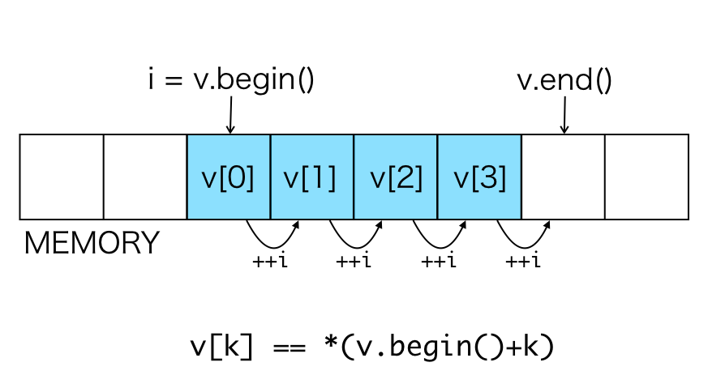

--- 
title: "Rcpp for everyone"
author: "Masaki E. Tsuda"
date: "`r Sys.Date()`"
site: bookdown::bookdown_site
output: bookdown::gitbook
config:
      toc:
        collapse: subsubsection
documentclass: book
description: "Introducing how to use Rcpp"
---


# Preface{-}

Rcpp is a package that enables you to implement R functions in C++. It is implemented so as to write your C++ code in a style similar to R, so it is easy to use even without deep knowledge of C++. And because Rcpp does not sacrifice execution speed for the ease of use, anyone can get high performance outcome.

This document focuses on providing necessary information to users who are not familiar with C++. Therefore, in some cases, rather than describing accurately from the viewpoint of C++, it explains conceptually so that the user can easily understand it.

I would greatly appreciate it if you kindly give me any feedback on this document.

[https://github.com/teuder/rcpp4everyone_en](https://github.com/teuder/rcpp4everyone_en)


<!--chapter:end:index.Rmd-->

# Suitable situations to use Rcpp

R is weak in some kinds of operations. If you need operations listed below, it is time to consider using Rcpp.

- Loop operations in which later iterations depend on previous iterations.
- Accessing each elements of a vector/matrix.
- Recurrent function calls within loops.
- Changing the size of vectors dynamically.
- Operations that need advanced data structures and algorithms.

<!--chapter:end:010_Rcpp_merit.Rmd-->

# Installation

Before developing with Rcpp, you need to install c++ compiler.

##Install C++ compiler

### Windows

Install [Rtools](https://cran.r-project.org/bin/windows/Rtools/index.html).

It might be helpful to refer instruction of RStan ([Install Rtools for Windows](https://github.com/stan-dev/rstan/wiki/Install-Rtools-for-Windows)) .


### Mac

Install Xcode command line tools. Execute the command `xcode-select --install` on Terminal.

### Linux

Install gcc and related packages. 

In Ubuntu Linux, execute the command `sudo apt-get install r-base-dev` on Terminal.


### Using other compilers installed by yourself

If you installed other compiler (g++, clang++) different from above, create the following file under the user's home directory. Then set environment variables in the file.

**Linux, Mac**

* `.R/Makevars`

**Windows**

* `.R/Makevars.win`

**Example settings of environmental variables**

```
CC=/opt/local/bin/gcc-mp-4.7
CXX=/opt/local/bin/g++-mp-4.7
CPLUS_INCLUDE_PATH=/opt/local/include:$CPLUS_INCLUDE_PATH
LD_LIBRARY_PATH=/opt/local/lib:$LD_LIBRARY_PATH
CXXFLAGS= -g0 -O2 -Wall
MAKE=make -j4
```


## Install Rcpp

You can install Rcpp by executing following code.

```r
install.packages("Rcpp")
```

<!--chapter:end:020_install.Rmd-->

# Basic usage

You can use your Rcpp function in 3 steps.

1. Writing Rcpp source code
2. Compiling the code
3. Executing the function

## Writing your Rcpp code

The below code define a function `rcpp_sum()` that calculate sum of a vector. Save this content as a file named "sum.cpp".

**sum.cpp**

```c++
//sum.cpp
#include <Rcpp.h>
using namespace Rcpp;

// [[Rcpp::export]]
double rcpp_sum(NumericVector v){
    double sum = 0;
    for(int i=0; i<v.length(); ++i){
        sum += v[i];
    }
    return(sum);
}
```

### Format for defining a function in Rcpp.

The following code shows the basic format for defining a Rcpp function.

```cpp
#include<Rcpp.h>
using namespace Rcpp;

// [[Rcpp::export]]
RETURN_TYPE FUNCTION_NAME(ARGMENT_TYPE ARGMENT){

    //do something

    return RETURN_VALUE;
}
```

* `#include<Rcpp.h>` : This sentence enables you to use classes and functions defined by the Rcpp package.

* `// [[Rcpp::export]]`：The function defined just below this sentence will be accessible from R.

* `using namespace Rcpp;` : This sentence is optional. But if you did not write this sentence, you have to add prefix `Rcpp::` to specify classes and functions defined by the Rcpp. (For example, `Rcpp::NumericVector`)

* `RETURN_TYPE FUNCTION_NAME(ARGMENT_TYPE ARGMENT){}`：You need to specify types of functions and arguments.

* `return RETURN_VALUE;`：`return` statement is mandatory.


## Compiling the code

The function `Rcpp::sourceCpp()` will compile the source code and load the function into R.

```R
library(Rcpp)
sourceCpp('sum.cpp')
```

## Executing the function

You can use your Rcpp function like as usual R function.

```r
> rcpp_sum(1:10)
[1] 55

> sum(1:10)
[1] 55
```

<!--chapter:end:030_basic_usage.Rmd-->

# Embedding Rcpp code in your R code

You can also write Rcpp code in your R code in 3 ways using `sourceCpp()` `cppFunction()` `evalCpp()` respectively.

## sourceCpp()

Save Rcpp code as string object in R and compile it with `sourceCpp()`.

``` R
src <-
"#include <Rcpp.h>
using namespace Rcpp;
// [[Rcpp::export]]
double rcpp_sum(NumericVector v){
  double sum = 0;
  for(int i=0; i<v.length(); ++i){
    sum += v[i];
  }
  return(sum);
}"

sourceCpp(code = src)
rcpp_sum(1:10)
```

## cppFunction()

The `cppFunction()` offers handy way to create single Rcpp function. You can omit `#include <Rcpp.h>` and `using namespase Rcpp;` when you use `cppFunction()`.

```r
src <-
  "double rcpp_sum(NumericVector v){
    double sum = 0;
    for(int i=0; i<v.length(); ++i){
      sum += v[i];
    }
    return(sum);
  }
  "
Rcpp::cppFunction(src)
rcpp_sum(1:10)
```

## evalCpp()

You can evaluate single C++ statement by using `evalCpp()`.

```r
# Showing maximum value of double.
evalCpp('std::numeric_limits<double>::max()')
```


<!--chapter:end:040_function.Rmd-->

# C++11

C++ 11 is a standard of C++ newly established in 2011, it introduces new functionalities and notations. Compared with the previous standard, many new features have been added to make C++ even easier for beginners. This document will actively exploit these features of C++11.

** Important: Code examples in this document are written assuming that C++11 is enabled. **

## Enabling C++11


To enable C ++ 11, add the following description somewhere in your Rcpp code.

```cpp
// [[Rcpp::plugins("cpp11")]]
```

## Recommended C++11 features


### Initializer list

Initialization of variables using `{}`.

```
// Initialize Vector
// The next three are the same as c (1, 2, 3).
NumericVector v1 = NumericVector::create(1.0, 2.0, 3.0);
NumericVector v2 = {1.0, 2.0, 3.0};
NumericVector v3   {1.0, 2.0, 3.0}; // You can omit "=".
```


### auto

Using the `auto` specifier will automatically set the type of the variable, according to the value to be assigned.

```
// variable "i" will be int
auto  i  = 4;

NumericVector v;
// variable "it" will be NumericVector::iterator
auto it = v.begin();
```


### decltype

With `decltype` you can declare variables of the same type as existing variables.

```
int i;
decltype(i) x; // variable "x" will be int
```


### Range-based for-loop

You can write a `for` statement with the same style as R.

```
IntegerVector v{1,2,3};
int sum=0;
for(auto& x : v) {
  sum += x;
}
```


### Lambda expression

You can create a function object by using lambda expression. Function object are usually used as unnamed function passed to other function.

Lambda expressions are written in the form `[](){}`.

In `[]`, you write a list of local variables you want to use in this function object.

- `[]` do not allow access to all the local variables from the function object.
- `[=]` will copy values of the all local variables to the function object.
- `[&]` enables direct access to all local variables from the function object.
- `[=x, &y]` means that the local variable "x" will be copied to the function object, and the local variable "y" is allowed to be accessed directly from the function object.

In `()`, you write arguments to be passed to this function object.

In `{}`, you describe processes you want.
  
**Return type of the lambda expression**

The return type of this function object is automatically set to the type of the returned value described in `{}`. If you want to define return type explicitly, write it like `[]()->int{}`.

**Example**

The following example shows how to use lambda expression. You can find Some types of C++ code can be written in the same style as R.

*R example*

``` R
v <- c(1,2,3,4,5)
A <- 2.0
res <-
  sapply(v, function(x){A*x})
```

*Rcpp example*

``` cpp
// [[Rcpp::plugins("cpp11")]]
// [[Rcpp::export]]
NumericVector rcpp_lambda_1(){
  NumericVector v = {1,2,3,4,5};
  double A = 2.0;
  NumericVector res =
    sapply(v, [&](double x){return A*x;});
  return res;
}
```

<!--chapter:end:050_c++11.Rmd-->

# Printing messages

You can print messages and values of objects on R console screen by using `Rprintf()` and `Rcout`.

`REprintf()` and `Rcerr` can be used for printing error messages.

## Rcout, Rcerr

The way of using `Rcout` and `Rcerr` is same as `std::cout` and `std::cerr`. Connecting messages or variables with `<<` in the order you want. When you give vector object to `<<`, it will print all the elements of the vector.

```cpp
// [[Rcpp::export]]
void rcpp_rcout(NumericVector v){
  // printing value of vector
  Rcout << "The value of v : " << v << "\n";

  // printing error message
  Rcerr << "Error message\n";
}
```

## Rprintf(), REprintf()

The way of using `Rprintf()` and `REprintf()` is same as `std::printf()`, it print message by specifying format.

```cpp
Rprintf( format, variables)
```
In the `format` string, you can use following format specifiers for printing the values of variables. When you want to print multiple variables, you have to pass these variables in the order that its corresponding specifier appears in the format string.

Only a part of format specifier is presented below, please refer to other documentation for detail (For example, [cplusplus.com](http://www.cplusplus.com/reference/cstdio/printf/)).

|specifier|explanation|
|:---:|---|
|`%i`| printing signed integer (`int`)|
|`%u`| printing unsigned integer (`unsigned int`)|
|`%f`| printing floating point number (`double`)|
|`%e`| printing floating point number (`double`) in exponential style|
|`%s`| printing C string (`char*`)|

Additionally, `Rprintf()` and `REprintf()` can only print data types that exist in standard C language, thus you cannot pass data types defined by Rcpp package (such as `NumericVector`) to `Rprintf()` directly. If you want to print the values of elements of Rcpp vector using `Rprintf()`, you have to pass each element separately to it (see below).

```cpp
// [[Rcpp::export]]
void rcpp_rprintf(NumericVector v){
    // printing values of all the elements of Rcpp vector  
    for(int i=0; i<v.length(); ++i){
        Rprintf("the value of v[%i] : %f \n", i, v[i]);
    }
}
```

<!--chapter:end:060_utility.Rmd-->

# Data types

All the basic data types and data structures provided by R are available in Rcpp. By using these data types, you can directly access to the objects exist in R.

## Vector and Matrix

Following seven data types are often used in R.

`logical` `integer` `numeric` `complex` `character` `Date` `POSIXct`

There are vector type and matrix types in Rcpp corresponding to those of R.

In this document, the word `Vector` and `Matrix` is used to specify all the vector and matrix types in Rcpp.

The table below present the correspondence of data types between R/Rcpp/C++.

|Value | R vector|Rcpp vector|Rcpp matrix|Rcpp scalar|C++ scalar|
|:---:|:---:|:---:|:---:|:---:|:---:|
|Logical|`logical`  |`LogicalVector`| `LogicalMatrix`| - |`bool`|
|Integer|`integer`  |`IntegerVector`|`IntegerMatrix`|-|`int`|
|Real|`numeric` |`NumericVector`|`NumericMatrix`|-|`double`|
|Complex|`complex`  |`ComplexVector`| `ComplexMatrix`|`Rcomplex`|`complex`|
|String|`character`|`CharacterVector` (`StringVector`)| `CharacterMatrix` (`StringMatrix`)|`String`|`string`|
|Date  |`Date`     |`DateVector`|-|`Date`|-|
|Datetime  |`POSIXct`  |`DatetimeVector`|-| `Datetime` | `time_t` |


## data.frame, list, S3, S4

Other than vector and matrix, There are several data structure in R such as data.frame, list, S3 class and S4 class. You can handle all of these data structuers in Rcpp.

|R|Rcpp|
|:---:|:---:|
|`data.frame`|`DataFrame`|
|`list`|`List`|
|S3 class|`List`|
|S4 class|`S4`|

In Rcpp, `Vector`, `DataFrame`, `List` are all implemented as kinds of vectors. Namely, `Vector` is a vector that its elements are scalar values, `DataFrame` is a vector that its elements are `Vector`s, `List` is a vector that its elements are any kinds of data types. Thus, `Vector`, `DataFrame`, `List` has many common member functions in Rcpp.


<!--
`Dataframe` は、様々な型のベクトルを要素として格納することができます。しかし、要素となる全てのベクトルの長さは等しいという制約があります。

`List` は、`Dataframe` や `List` を含む、どのような型のオブジェクトでも要素として持つことができます。要素となるベクトルの長さにも制限はありません。

S3 クラスは属性 `class` に独自の名前が設定されたリストですので、使い方は `List` と同様です。

S4 クラスはスロット（`slot`）と呼ばれる内部データを持っています。Rcpp の `S4` を用いることで R で定義した S4 クラスのオブジェクトの作成、および、スロットへのアクセスが可能になります。
-->

<!--chapter:end:070_data_types.Rmd-->

# Vector

## Creating vector object


```cpp
// v <- rep(0, 3)
NumericVector v (3);

// v <- rep(1, 3)
NumericVector v (3,1);

// v <- c(1,2,3) C++11 Initializer list
NumericVector v = {1,2,3};

// v <- c(1,2,3)
NumericVector v = NumericVector::create(1,2,3);

// v <- c(x=1, y=2, z=3)
NumericVector v =
  NumericVector::create(Named("x",1), Named("y")=2 , _["z"]=3);
```

## Accessing vector elements

You can access to individual element of a vector object using `[]` or `()` operator. Both operators accept NumericVector/IntegerVector (numerical index), CharacterVector (element names) and LogicalVector. `[]` operator ignores out of bound access, while `()` operator throws an exception `index_out_of_bounds`.

It is important to note that vector indices in C++ start at 0.

** [Important] : Vector indices start at 0 in C++. **


```cpp
// [[Rcpp::export]]
void rcpp_vector_access(){

  // Creating vector
  NumericVector v  {10,20,30,40,50};

  // Setting element names
  v.names() = CharacterVector({"A","B","C","D","E"});

  // Preparing vector for access
  NumericVector   numeric = {1,3};
  IntegerVector   integer = {1,3};
  CharacterVector character = {"B","D"};
  LogicalVector   logical = {false, true, false, true, false};

  // Getting values of vector elements
  double x1 = v[0];
  double x2 = v["A"];
  NumericVector res1 = v[numeric];
  NumericVector res2 = v[integer];
  NumericVector res3 = v[character];
  NumericVector res4 = v[logical];

  // Assigning values to vector elements
  v[0]   = 100;
  v["A"] = 100;
  NumericVector v2 {100,200};
  v[numeric]   = v2;
  v[integer]   = v2;
  v[character] = v2;
  v[logical]   = v2;
}
```

## Member functions

Member functions (also called as Methods) are functions that is attached to individual object. You can call member functions `f()` of object `v` in the form of `v.f()`.

```cpp
NumericVector v = {1,2,3,4,5};

// Calling member function
int n = v.length(); // 5
```

The Vector object in Rcpp have member functions listed below.


### length(), size()

return the number of elements of this vector object.

### names()

return the element names of this vector object as CharacterVector.

### offset( name ), findName( name )

return numerical index of the element specified by character string `name`.

### offset( i )

return numerical index of the element specified by numerical index `i` after doing bounds checking to ensure `i` is valid.

### fill( x )

fill all the element of this vector object with scalar value `x`.

### sort()

return a vector that sorts this vector object in ascending order.

### assign( first_it, last_it )

assign values specified by the iterator `first_it` and `last_it` to this vector object.

### push_back( x )

append a scalar value `x` to the end of this vector object.

### push_back( x, name )

append a scalar value `x` to the end of this vector object and set name of the element as character string `name`.

### push_front( x )

append a scalar value `x` to the front of this vector.

### push_front( x, name )

append a scalar value `x` to the front of this vector and set name of the element as character string `name`.

### begin()

return an iterator pointing to the first element of the vector.

### end()

return an iterator pointing to the end of the vector (**one past the last element of this vector**).


### cbegin()

return a const iterator pointing to the first element of the vector.

### cend()

return a const iterator pointing to the end of the vector (**one past the last element of this vector**).


### insert( i, x )

insert scalar value `x` to the position pointed by numerical index `i`. Return the iterator pointing the inserted element.


### insert( it, x )

insert scalar value `x` to the position pointed by iterator `it`. Return the iterator pointing the inserted element.

### erase(i)

erase element at the position pointed by numerical index `i`. Return the iterator pointing the element just behind the erased element.

### erase(it)

erase element at the position pointed by iterator `it`. Return the iterator pointing the element just behind the erased element.

### erase( first_i, first_i )

erase elements from the position pointed by numerical index `first_i` to `last_i - 1`. Return the iterator pointing the element just behind the erased elements.

### erase( first_it, last_it )

erase elements from the position pointed by iterator `first_it` to `last_it - 1`. Return the iterator pointing the element just behind the erased elements.

### containsElementNamed(name)

return `true` if this vector contains an element with the name specified by character string `name`.


## Static member functions

Static member function is the function that is attached to the class from which an object being molded. Static member functions is called in the form such as `NumericVector::create()`.

### get_na()

return the `NA` value of this `Vector` class.

### is_na(x)

return `true` if a vector element specified by `x` is `NA`.


### create( x1, x2, ...)

create a `Vector` object containing elements specified by scalar value `x1` and `x2`. Maximum number of arguments are 20.

### import( first_it , last_it )

create a `Vector` object filled with data from the position pointed by iterator `first_it` to `last_it - 1`.

### import_transform( first_it, last_it, func)

create a `Vector` object filled with data from the position pointed by iterator `first_it` to `last_it - 1` that is transformed by function specified by `func`.

<!--chapter:end:080_vector.Rmd-->

# Matrix

## Creating Matrix object

Like Vector, Matrix object can be created in several ways.

```r
// Create a matrix equivalent to
// m <- matrix(0, nrow=2, ncol=2)
NumericMatrix m1( 2 );

// Create a matrix equivalent to
// m <- matrix(0, nrow=2, ncol=3)
NumericMatrix m2( 2 , 3 );

// m <- matrix(v, nrow=2, ncol=3) と同等の行列を作成します
NumericMatrix m3( 2 , 3 , v.begin() );
```

In addition, a matrix in R is actually a vector that the number of rows and columns are set in the attribute `dim`. So if you created a vector with attribute `dim` in Rcpp and return it to R. It will be treated as a matrix.


```cpp
// [[Rcpp::export]]
NumericVector rcpp_matrix(){
    // Creating a vector object
    NumericVector v = {1,2,3,4};

    // Set number of rows and columns to attribute dim
    v.attr("dim") = Dimension(2, 2);

    // Returns a vector with attribute dim to R
    return v;
}
```

Execution result

```
> rcpp_matrix()
     [,1] [,2]
[1,]    1    3
[2,]    2    4
```

However, even if you set a value to attribute `dim` of a vector object, the type of the object in Rcpp will remain Vector type. To convert it to Matrix type in Rcpp, you need to use `as<T>()` function.

```cpp
// Set number of rows and columns to attribute dim
v.attr("dim") = Dimension(2, 2);

// Converting to Rcpp Matrix type
NumericMatrix m = as<NumericMatrix>(v);
```

## Accessing to Matrix elements

By using `()` operator, you can get and assign the values of the elements of the matrix by specifying its column number and row number. As in the case of vectors, row numbers and column numbers in Matrix start with 0. If you want to access to a specific row or column, use the symbol `_`.

You can also use the `[]` operator to access an element as a vector connecting the columns of a matrix.


```cpp
// Creating a 5x5 numerical matrix
NumericMatrix m( 5, 5 );

// Retrieving the element of row 0 and column 2
double x = m( 0 , 2 );

// Copying the value of row 0 to the vector v
NumericVector v = m( 0 , _ );

// Copying the value of column 2 to the vector v
NumericVector v = m( _ , 2 );

// Copying the row (0 to 1) and column (2 to 3) to the matrix m2
NumericMatrix m2 = m( Range(0,1) , Range(2,3) );

// Accessing matrix element as vector
m[5]; // This points to the same element as m(0,1)
```


**References to row, column and sub matrix**

Rcpp also provides types that hold "references" to some column and row of a matrix.

```cpp
NumericMatrix::Column col = m( _ , 1);  // Reference to the column 1
NumericMatrix::Row    row = m( 1 , _ ); // Reference to the row 1
NumericMatrix::Sub    sub = m( Range(0,1) , Range(2,3) ); // Reference to sub matrix
```
Substituting a value to a "reference" object of a matrix will assign the value to its original matrix. For example, assigning a value to `col` will assign a value to the column 1 of `m`.

```cpp
col = 2 * col;             // The value of the column 1 of matrix m will be doubled
m( _ , 1) = 2 * m( _ , 1 ) // Synonymous with the above example
```


## Member functions

Since `Matrix` is actually `Vector`, `Matrix` basically has the same member functions as `Vector`. Below is a member function unique to `Matrix`.

### nrow() rows()

Returns the number of rows.

### ncol()　cols()

Returns the number of columns.

###row( i )

Return a reference `Vector::Row` to the `i`th　row.

###column( i )

Return a reference `Vector::Column` to the `i`th　column.

### fill_diag( x )

Fill diagonal elements with scalar value `x`.

### offset( i, j )

Returns the numerical index in the original vector of the matrix corresponding to the element of row `i` and column `j`.


## Static member functions

`Matrix` basically has the same static member function as `Vector`. The static member functions unique to `Matrix` are shown below.

### Matrix::diag( size, x )

Returns a diagonal matrix whose number of rows and columns equals to "size" and the value of the diagonal element is "x".


## Other functions related to Matrix

This section shows functions relating to Matrix.

### rownames( m )

Get and set the row name of matrix m.

```
CharacterVector ch = rownames(m);
rownames(m) = ch;
```

### colnames( m )

Get and set the column name of matrix m.

```
CharacterVector ch = colnames(m);
colnames(m) = ch;
```


### transpose( m )

Returns the transposed matrix of matrix m.

<!--chapter:end:100_matrix.Rmd-->

# Vector operations

## Arithmetic operations

By using the `+ - * /` operator you can perform elementwise arithmetic operations between vectors of the same length.

```
NumericVector x ;
NumericVector y ;

// Vector and vector operation
NumericVector res = x + y ;
NumericVector res = x - y ;
NumericVector res = x * y ;
NumericVector res = x / y ;

// Vector and scalar operation
NumericVector res = x   + 2.0 ;
NumericVector res = 2.0 - x;
NumericVector res = y   * 2.0 ;
NumericVector res = 2.0 / y;

// expression and expression operation
NumericVector res = x * y + y / 2.0 ;
NumericVector res = x * ( y - 2.0 ) ;
NumericVector res = x / ( y * y ) ;
```

The `-` operator inverts the sign.

```
NumericVector res = -x ;
```

## Comparison operations

Comparison of vectors using `==` `! =` `<` `>` `> =` `<=` operators produces logical vectors. You can also access vector elements using logical vectors.

```cpp
NumericVector x ;
NumericVector y ;

// Comparison of vector and vector
LogicalVector res = x < y ;
LogicalVector res = x > y ;
LogicalVector res = x <= y ;
LogicalVector res = x >= y ;
LogicalVector res = x == y ;
LogicalVector res = x != y ;

// Comparison of vector and scalar
LogicalVector res = x < 2 ;
LogicalVector res = 2 > x;
LogicalVector res = y <= 2 ;
LogicalVector res = 2 != y;

// Comparison of expression and expression
LogicalVector res = ( x + y ) < ( x*x ) ;
LogicalVector res = ( x + y ) >= ( x*x ) ;
LogicalVector res = ( x + y ) == ( x*x ) ;
```

The `!` operator negates the logical value.

```
LogicalVector res = ! ( x < y );
```

Accessing the elements of the vector using logical vectors.

```cpp
NumericVector res = x[x < 2];
```

<!--chapter:end:110_calculation.Rmd-->

# Logical operations

## LogicalVector

### Data type of LogicalVector elements  

Since boolean type in C++ is `bool`, you may think that the type of the element of `LogicalVector` is also `bool`, but it is `int`. This is because `bool` type can only represent `true` or `false`, but there are three possible values `TRUE`,` FALSE`, and `NA` for elements of the logical vector in R.

In Rcpp, `TRUE` is represented by 1,` FALSE` by 0, and `NA` by` NA_LOGICAL` (minimum value of int: -2147483648).

|R|Rcpp|int|bool|
|:---:|:---:|:---:|:---:|
|TRUE|TRUE|1 (Values other than 0 and -2147483648)|true|
|FALSE|FALSE|0|false|
|NA|NA_LOGICAL|-2147483648|true|


## Logical operations

Use the operator `&` (logical product) `|` (logical sum) `!` (Logical negation) for the logical operation for each element of LogicalVector.

```
LogicalVector v1 = {1,1,0,0};
LogicalVector v2 = {1,0,1,0};

LogicalVector res1 = v1 & v2;
LogicalVector res2 = v1 | v2;
LogicalVector res3 = !(v1 | v2);

Rcout << res1 << "\n"; // 1 0 0 0
Rcout << res2 << "\n"; // 1 1 1 0
Rcout << res3 << "\n"; // 0 0 0 1
```

## Function that receives LogicalVector

Examples of functions that receive `LogicalVector` are `all()`, `any()` and `ifelse()`.

### all(),  any()

For `LogicalVector` v, `all (v) `returns` TRUE` when all elements of v are `TRUE`, and `any(v)` returns `TRUE` if any of v's elements are `TRUE`.

You can not use the return value of the `all()` and `any()` as the conditional expression of the `if` statement. This is because the return type of the `all()` and `any()` is not `bool` but `SingleLogicalResult`. To use the return value of the `all()` and `any()` as a conditional expression of an `if` statement, use the function `is_true()`, `is_false()` and `is_na()`. These functions convert `SingleLogicalResult` to `bool`.

The code example below shows how to use the return values of the functions `all()` and `any()` as a conditional expression of an `if` statement. In this example, the conditional expression of all `if` statements will be `true`, and the return value of `all()`, `any()` will be displayed.

```cpp
// [[Rcpp::export]]
List rcpp_logical_03(){
  LogicalVector v1 = LogicalVector::create(1,1,1,NA_LOGICAL);
  LogicalVector v2 = LogicalVector::create(0,1,0,NA_LOGICAL);

  // Behavior of all (), any () for LogicalVector including NA is the same as R
  LogicalVector lv1 = all( v1 );   // NA
  LogicalVector lv2 = all( v2 );   // FALSE
  LogicalVector lv3 = any( v2 ); // TRUE

  // In case assigning to bool
  bool b1 = is_true ( all(v1) );  // false
  bool b2 = is_false( all(v1) );  // false
  bool b3 = is_na   ( all(v1) );  // true

  // In case used in conditional expression of if statement
  if(is_na(all( v1 ))) { // OK
    Rcout << "all( v1 ) is NA\n";
  }

  return List::create(lv1, lv2, lv3, b1, b2, b3);
}
```

### ifelse()

`ifelse (v, x1, x2)` receives the logical vector v, and returns the corresponding element of x1 when the element of v is `TRUE` and the corresponding element of x2 when it is` FALSE`. Although x1 and x2 can be vectors or scalars, in the case of vectors the length of x1 and x2 must match the length of v.

```cpp
NumericVector v1;
NumericVector v2;

//Number of elements of vector
int n = v1.length();

// In case, both x1 and x2 are scalar
IntegerVector res1     = ifelse( v1>v2, 1, 0);
NumericVector res2     = ifelse( v1>v2, 1.0, 0.0);
//CharacterVector res3 = ifelse( v1>v2, "T", "F"); // not supported


// Since ifelse() does not work with a scalar character string,
// in order to obtain results equivalent to R,
// we need to use a string vector whose values of elements are all the same.
CharacterVector chr_v1 = rep(CharacterVector("T"), n);
CharacterVector chr_v2 = rep(CharacterVector("F"), n);
CharacterVector res3   = ifelse( v1>v2, chr_v1, chr_v2);

// In case, x1 and x2 are vector and scalar
IntegerVector int_v1, int_v2;
NumericVector num_v1, num_v2;
IntegerVector   res4 = ifelse( v1>v2, int_v1, 0);
NumericVector   res5 = ifelse( v1>v2, num_v1, 0.0);
CharacterVector res6 = ifelse( v1>v2, chr_v1, Rf_mkChar("F")); // Note

// In case, x1 and x2 are vector and vector
IntegerVector   res7 = ifelse( v1>v2, int_v1, int_v2);
NumericVector   res8 = ifelse( v1>v2, num_v1, num_v2);
CharacterVector res9 = ifelse( v1>v2, chr_v1, chr_v2);
```
Note: `Rf_mkChar ()` is a function that convert C language string (`char*`) to `CHARSXP` (type of element of `CharacterVector`).


## Evaluation of elements of LogicalVector 

The value of the element of `LogicalVector` should not be used as a conditional expression of `if` statement. Because the conditional expression of the C++ `if` statement evaluates the value of the expression as a `bool` type. `bool` type evaluates all values other than 0 as `true`, thus the `NA` of `LogicalVector` (`NA_LOGICAL`) is evaluated as `true`.

See the following code example for how to evaluate the value of an element of `LogicalVector` with an `if` statement.

```cpp
// [[Rcpp::export]]
LogicalVector rcpp_logical(){

  // Create an integer vector containing NA
  IntegerVector x = {1,2,3,4,NA_INTEGER};

  // The result of the comparison operation becomes LogicalVector
  LogicalVector v = (x >= 3);

   // If you use the element of LogicalVector directly in the "if" statement
   // NA_LOGICAL will be evaluated as TRUE
  for(int i=0; i<v.size();++i) {
    if(v[i]) Rprintf("v[%i] is evaluated as true.\n",i);
    else Rprintf("v[%i] is evaluated as false.\n",i);
  }

  // Evaluate the elements of LogicalVector
  for(int i=0; i<v.size();++i) {
    if(v[i]==TRUE) Rprintf("v[%i] is TRUE.\n",i);
    else if (v[i]==FALSE) Rprintf("v[%i] is FALSE.\n",i);
    else if (v[i]==NA_LOGICAL) Rprintf("v[%i] is NA.\n",i);
    else Rcout << "v[" << i << "] is not 1\n";
  }

  // Displays the value of TRUE, FALSE and NA_LOGICAL
  Rcout << "TRUE " << TRUE << "\n";
  Rcout << "FALSE " << FALSE << "\n";
  Rcout << "NA_LOGICAL " << NA_LOGICAL << "\n";

  return v;
}
```

Execution result

```
> rcpp_logical()
v[0] is evaluated as false.
v[1] is evaluated as false.
v[2] is evaluated as true.
v[3] is evaluated as true.
v[4] is evaluated as true.
v[0] is FALSE.
v[1] is FALSE.
v[2] is TRUE.
v[3] is TRUE.
v[4] is NA.
TRUE 1
FALSE 0
NA_LOGICAL -2147483648
[1] FALSE FALSE  TRUE  TRUE    NA
```


<!--chapter:end:120_logical.Rmd-->

# DataFrame

This chapter explains how to create `DataFrame` object, how to access its elements, and its member functions. In Rcpp, `DataFrame` is implemented as a kind of vector. In other words, `Vector` is a vector whose element is scalar value, while `DataFrame` is a vector whose elements are `Vector`s of the same length. Therefore, `Vector` and `DataFrame` have many common methods of creating objects, accessing elements, and member functions.

## Creating a DataFrame object

`DataFrame::create()` is used to create a `DataFrame` object. Also, use `Named()` or `_[]` if you want to specify column names when creating `DataFrame`　object.

```cpp
// Creating DataFrame df from Vector v1, v2
DataFrame df = DataFrame::create(v1, v2);
// When giving names to columns
DataFrame df = DataFrame::create( Named("V1") = v1 , _["V2"] = v2 );
```

When you create a `DataFrame` with` DataFrame::create() `, the value of the original` Vector` element will not be duplicated in the columns of the `DataFrame`, but the columns will be the "reference" to the original `Vector`. Therefore, changing the value of the original `Vector` changes the value of the columns. To avoid this, we use the `clone()` function to duplicate the value of the `Vector` element when creating a `DataFrame` column.

To see the difference between using the `clone()` function and not using it, see the code example below. In the code example, we are creating `DataFrame` df from `Vector` v. There, column V1 is a reference to v, and column V2 replicates the value of v by the `clone ()` function. After that, if you change to `Vector` v, the values of column V1 is changed, but V2 is not affected.

``` cpp
// [[Rcpp::export]]
DataFrame rcpp_df(){
    // Creating vector v
    NumericVector v = {1,2};
    // Creating DataFrame df
    DataFrame df = DataFrame::create( Named("V1") = v,         // simple assign
                                      Named("V2") = clone(v)); // using clone()
    // Changing vector v
    v = v * 2;
    return df;
}
```

Execution result

```
> rcpp_df()
  V1 V2
1  2  1
2  4  2
```


## Accessing DataFrame elements

When accessing a specific column of `DataFrame`, the column is temporarily assigned to `Vector` object and accessed via the object. As with `Vector`, the `DataFrame` column can be specified by a numeric vector (column number), a string vector (column name), and a logical vector.

```
NumericVector v1 = df[0];
NumericVector v2 = df["V2"];
```

As with `DataFrame` creation, assigning a` DataFrame` column to `Vector` in the above way will not copy the column  value to `Vector` object, but it will be a "reference" to the column. Therefore, when you change the values of `Vector` object, the content of the column will also be changed.

If you want to create a `Vector` by copying the value of the column, use `clone()` function so that the value of the original `DataFrame` column is not changed.

```
NumericVector v1 = df[0]; // v1 becomes "reference" to the 0th column of df
v1 = v1 * 2;              // Changing the value of v1 also changes the value of df[0]

NumericVector v2 = clone(df[0]); // Duplicate the value of the element of df[0] to v2
v2 = v2*2;                       // Changing v2 does not change the value of df [0]
```


## Member functions

In Rcpp, `DataFrame` is implemented as certain kinds of vectors. In other words, `Vector` is a vector whose elements are scalar values, and `DataFrame` is a vector whose elements are `Vector`s. Therefore, `DataFrame` has many member functions common to `Vector`.

### length() size()

Returns the number of columns.


### nrows()

Returns the number of rows.

### names()

Returns the column name as a CharacterVector.

### offset(name) findName(name)

Returns the numerical index of the column with the name specified by the string "name".

### fill(v)

fills all the columns of this `DataFrame` with` Vector` v.

### assign( first_it, last_it)

Assign columns in the range specified by the iterators first_it and last_it to this `DataFrame`.

### push_back(v)

Add `Vector` v to the end of this` DataFrame`.

### push_back( v, name )

Append a `Vector` v to the end of this` DataFrame`. Specify the name of the added column with the string "name".

### push_front(x)

Append a `Vector` v at the beginning of this` DataFrame`.


### push_front( x, name )

Append a `Vector` v at the beginning of this` DataFrame`. Specify the name of the added column with the string "name".

### begin()

Returns an iterator pointing to the first column of this `DataFrame`.

### end()

Return an iterator pointing to the end of this `DataFrame`.

### insert( it, v )

Add `Vector` v to this `DataFrame` at the position pointed by the iterator `it` and return an iterator to that element.

### erase(i)

Delete the `i`th column of this `DataFrame` and return an iterator to the column just after erased column.

### erase(it)

Deletes the column specified by the iterator `it` and returns an iterator to the column just after erased column.

###erase(first_i, last_i)

Deletes the `first_i`th to `last_i - 1`th columns and returns an iterator to the column just after erased column.

### erase(first_it, last_it)

Deletes the range of columns from those specified by the iterator `first_it` to those specified by `last_it - 1` and returns an iterator to the column just after the erased columns.

### containsElementNamed(name)

Returns true if this `DataFrame` has a column with the name specified by the string `name`.

### inherits(str)

Returns true if the attribute "class" of this object contains the string `str`.

<!--chapter:end:140_dataframe.Rmd-->

# List

This chapter explains how to create `List` object, how to access its elements, and its member functions. In Rcpp, `List` is implemented as a kind of vector. In other words, `Vector` is a vector whose element is scalar value, while `List` is a vector whose elements are any kinds of data types. Therefore, `Vector` and `List` have many common methods of creating objects, accessing elements, and member functions.

Since the contents described on the page of [DataFrame](dataframe.md) can be mostly valid by replacing `DataFrame` with` List`, please refer to that for details.

## Creating List object

To create a `List` object we use the `List::create()` function. Also, to specify the element name when creating `List`, use `Named()` function or `_[] `.

```cpp
// Create list L from vector v1, v2
List L = List::create(v1, v2);

// When giving names to elements
List L = List::create(Named("name1") = v1 , _["name2"] = v2);
```

## Accessing List elements

When accessing a specific element of `List`, we assign it to the other object and access it via that object.

The elements of `List` can be specified by numerical index, element names and logical vector.

```cpp
NumericVector v1 = L[0];
NumericVector v2 = L["V1"];
```

## Member functions

`List` has the same member functions as `Vector`.

<!--chapter:end:150_list.Rmd-->

# S3・S4 class

## S3 class

The S3 class is actually a list whose attribute `class` has its own value. For that, see the section `List` and  section Attributes for creating S3 objects and accessing its elements.

In the code example below, as an example of handling objects of S3, we show the function that receives the return value of function `lm()` and computes RMSE (Root Mean Square Error) as an index of the prediction accuracy of the model in the learning data.

```cpp
//Receiving lm() model object and calculate RMSE
// [[Rcpp::export]]
double rcpp_rmse(List lm_model) {
    // Since S3 is a list, data type of the argument is specified as List.

    // If the object given to this function is not an lm() model object,
    // it outputs an error message and stops execution.
    if (! lm_model.inherits("lm")) stop("Input must be a lm() model object.");

    // Extracting residuals (i.e. actual - prediction) from the S3 object
    NumericVector resid  = lm_model["residuals"];

    // Number of elements of the residual vector
    R_xlen_t n = resid.length();

    // The sum of squares of the residual vector
    double rmse(0.0);
    for(double& r : resid){
        rmse += r*r;
    }

    // Divide the residual sum of squares by the number of elements and take the square root
    return(sqrt((1.0/n)*rmse));
}
```

As an example of execution, use R's sample data `mtcars` to calculate the RMSE of the model linearly regressing the fuel efficiency of the car.

```R
> mod <- lm(mpg ~ ., data = mtcars)
> rcpp_rmse(mod)
[1] 2.146905
```


## S4 class


### Accessing to slot

To access the slots of a S4 class object, use the `slot()` member function. Also, use the `hasSlot()` member function to check if the object have a slot with a specific name.

```cpp
x.slot("slot_name");
x.hasSlot("slot_name");
```

### Creating a new S4 class object

Rcpp alone can not define a new S4 class, but you can create an S4 class object defined in R.

The following code example shows how to define a new S4 class Person in R, then create an object of Person class with Rcpp.

We first define S4 class "Person". This class holds name and birthday of a person in slot `name` and `birth`.

```R
# R code
# Defining S4 class Person in R
setClass (
  # Class name
  "Person",

  # Defining slot type
  representation (
    name = "character",
    birth = "Date"
  ),

  # Initializing slots
  prototype = list(
    name = as.character(NULL),
    birth = as.Date(as.character(NULL))
  )
)

# Creating an object of Person class in R
person_01 <- new("Person",
                 name = "Ronald Fisher",
                 birth = as.Date("1890-02-17"))
```

The following code example creates an object of Person class in Rcpp and set values for the slots.

```cpp
// [[Rcpp::export]]
S4 rcpp_s4(){

    // Creating an object of Person class
    S4 x("Person");

    // Setting values to the slots
    x.slot("name")  = "Sewall Wright";
    x.slot("birth") = Date("1889-12-21");

    return(x);
}
```

Execution result

```
> rcpp_s4()
An object of class "Person"
Slot "name":
[1] "Sewall Wright"

Slot "birth":
[1] "1889-12-21"
```

<!--chapter:end:160_s3_s4.Rmd-->

# String

`String` is a scalar type corresponding to the element of `CharacterVector`. `String` can also handle NA values (`NA_STRING`) which are not supported by the C character string `char*` and the C++ string `std::string`.

## Creating String object

There are roughly　three ways to create a `String` object, as follows. The first method is to create from a C/C++ string, the second is to create it from another `String` object, and the third is to create it from one element of a `CharacterVector`.

```cpp
// Creating from C string
String s("X"); // "X"

// Creating from Rcpp String
String s(str);

//Creating from single element of CharacterVector object
String s(char_vec[0])
```

## Operators

The `+=` operator is defined in `String` type. This allows you to combine another string object at the end of the string. (Note that the `+` operator is not defined)

```
// Creating String object
String s("A");

// Conbining a string
s += "B";

Rcout << s << "\n"; // "AB"
```


## Member functions

Note: The member functions `replace_first()`, `replace_last()`, `replace_all()` do not just return the replaced character string, but instead rewrite the value of this object.

### replace_first( str, new_str )

Replace first substring that matches the string `str` with the string `new_str`.

### replace_last( str, new_str )

Replace last substring that matches the string `str` with the string `new_str`.

### replace_all( str, new_str )

Replace all substrings that matches the string `str` with the string `new_str`.

### push_back(str)

Combine the string `str` to the end of this `String` object. (Same as += operator)

### push_back(str)

Combine the string str at the beginning of this `String` object.

### set_na()

Set NA value to this `String` object.

### get_cstring()

Convert the string of this String object into a C character string constant (const char*) and return it.

### get_encoding()

Returns the character encoding ( "bytes", "latin1", "UTF-8", "unknown").

### set_encoding(str)

Set the character encoding specified by the character string `str`.


### Code example

```
// [[Rcpp::export]]
void rcpp_replace(){

    // Replace only at the first occurrence of "ab"
    String s("abcdabcd");
    s.replace_first("ab", "AB");
    Rcout << s.get_cstring() << "\n"; // ABcdabcd

    // Replace only at the last occurrence of "ab"
    s="abcdabcd";
    s.replace_last("ab", "AB");
    Rcout << s.get_cstring() << "\n"; // abcdABcd

    // Replace every occurrence of "ab"
    s="abcdabcd";
    s.replace_all("ab", "AB");
    Rcout << s.get_cstring() << "\n"; // ABcdABcd
}
```

<!--chapter:end:170_string.Rmd-->

# Date

`Date` is a scalar type corresponding to an element of `DateVector`.

## Creating Date object

```cpp
Date d;       //"1970-01-01"
Date d(1);    //"1970-01-01" + 1day
Date d(1.1);  //"1970-01-01" + ceil(1.1)day
Date( "2000-01-01", "%Y-%m-%d"); //default format is "%Y-%m-%d"
Date( 1, 2, 2000); // 2000-01-02 Date(mon, day, year)
Date( 2000, 1, 2); // 2000-01-02 Date(year, mon, day)
```
## Operators

`Date` has operators `+, -, <, >, >=, <=, ==, !=`. By using these operators, you can perform addition of days (`+`), difference calculation of date (`-`), comparison of dates (`<, <=, >, >=, ==, !=`) .
```
// [[Rcpp::export]]
DateVector rcpp_date1(){
    // Creating Date objects
    Date d1("2000-01-01");
    Date d2("2000-02-01");

    int  i  = d2 - d1; // difference of dates
    bool b  = d2 > d1; // comparison of dates

    Rcout << i << "\n"; // 31
    Rcout << b << "\n"; // 1


    DateVector date(1);
    date[0] = d1 + 1;  // adding 1 day to d1

    return date; // 2000-01-02
}
```


## Member functions


### getDay()

Returns the day of the date.

### getMonth()

Returns the month of the date.

### getYear()

Returns the year of the date.

### getWeekday()

Returns the day of the week as an int. (1:Sun 2:Mon 3:Tue 4:Wed 5:Thu 6:Sat)

### getYearday()

Returns the number of the date through the year with January 1st as 1 and December 31st as 365.

### is_na()

Returns `true` if this object is NA.

## Execution result

```
Date d("2016-1-1");
Rcout << d.getDay() << endl;     //1
Rcout << d.getMonth() << endl;   //1
Rcout << d.getYear() << endl;    //2016
Rcout << d.getWeekday() << endl; //6
Rcout << d.getYearday() << endl; //1
```

<!--chapter:end:180_date.Rmd-->

# Datetime

`Datetime` is a scalar type corresponding to the elements of` DatetimeVector`.

## Creating Datetime object

As with Date, Datetime is also created by specifying the number of seconds from 1970-01-01 00:00:00 UTC (Coordinated Universal Time), and by explicitly specifying the date and time.

The format to explicitly specify the date and time is `Datetime dt(str, format)`. This format converts the string `str` to `Datetime` with the format string `format`. Please refer to `help(strptime)` in R for symbols used in the format string.

```
// Creating Datetime object it with elapsed seconds since 00:00:00 on January 1, 1970
Datetime dt;         // "1970-01-01 00:00:00 UTC"
Datetime dt(10.1);   // "1970-01-01 00:00:00 UTC" + 10.1 sec

// Creating by specifying the date and time
// The default format is "%Y-%m-%d %H:%M:%OS"
// The specified date and time are interpreted as vthe date and time of the local time zone
Datetime dt("2000-01-01 00:00:00");
Datetime dt("2000年1月1日 0時0分0秒", "%Y年%m月%d日 %H時%M分%OS秒");
```

## Time zone

`Datetime` internally manages the date and time in seconds (real number) from `1970-01-01 00:00:00` in Coordinated Universal Time (UTC). For example, `Datetime dt(10)` represents the point after 10 seconds from `1970-01-01 00:00:00 UTC`. When this value is returned to R, it is displayed as the time converted to the executed time zone. For example, in Japan, Japan Standard Time (JST) is UTC + 9 hours, so `Datetime d(10)` will be `1970-01-01 09:00:10 JST`.

When creating a Datetime object in the form of `Datetime dt(str, format)`, `str` is interpreted as the time in the local timezone. For example, if you run `Datetime dt(2000-01-01 00:00:00);` in Japan Standard Time (JST), the value of `1999-12-31 15:00:00 UTC` is set internally.


## Operators

The `+, -, <, >, >=, <=, ==, !=` operators are defined in `Datetime`.

By using these operators, you can perform addition of seconds (`+`), difference of datetime (`-`) in seconds, comparison of datetime (`<, <=, >, >=, ==, !=`) .

```cpp
Datetime dt1("2000-01-01 00:00:00");
Datetime dt2("2000-01-02 00:00:00");

// difference of datetime (seconds)
int sec = dt2 - dt1;  // 86400

// addition of seconds
dt1 = dt1 + 1; // "2000-01-01 00:00:01"

// comparison of datetime
bool b = dt2 > dt1; // true
```


## Member functions

Note: The value output using these member functions is the time interpreted at the time of Coordinated Universal Time. Therefore, it looks different from the date and time of the user's time zone. (For example, refer to the execution result of the code at the end of this chapter)

### getFractionalTimestamp()

Returns the number of seconds (real number) from the base date (1970-01-01 00: 00: 00 UTC).

### getMicroSeconds()

Returns the microseconds of the date and time at the Coordinated Universal Time. This value express the value of the second after decimal point in units of microseconds. (i.e. 0.1 second = 100000 microseconds)

### getSeconds()

Returns the second of the date and time in Coordinated Universal Time.

### getMinutes()

Returns the minute of the date and time in Coordinated Universal Time.


### getHours()

Returns the hour of the date and time in Coordinated Universal Time.

###getDay()

Returns the day of the date and time in Coordinated Universal Time.

###getMonth()

Returns the month of the date and time in Coordinated Universal Time.

### getYear()

Returns the year of the date and time in Coordinated Universal Time.

###getWeekday()

Returns the day of the week of the date and time in Coordinated Universal Time in `int`.

1:Sun 2:Mon 3:Tue 4:Wed 5:Thu 6:Sat

### getYearday()

Returns the number of the date through the year with January 1st as 1 and December 31st as 365.

### is_na()

Returns `true` if this object is `NA`.


## Code example

The code example below shows the result of executing in Japan Standard Time (JST) environment.


```
// [[Rcpp::export]]
Datetime rcpp_datetime(){
    // Creating Datetime object by specifying date and time to
    Datetime dt("2000-01-01 00:00:00");

    // Displaying parts of the Datetime object in Coordinated Universal Time
    Rcout << "getYear " << dt.getYear() << "\n";
    Rcout << "getMonth " << dt.getMonth() << "\n";
    Rcout << "getDay " << dt.getDay() << "\n";

    Rcout << "getHours " << dt.getHours() << "\n";
    Rcout << "getMinutes " << dt.getMinutes() << "\n";
    Rcout << "getSeconds " << dt.getSeconds() << "\n";

    Rcout << "getMicroSeconds " << dt.getMicroSeconds() << "\n";
    Rcout << "getWeekday " << dt.getWeekday() << "\n";
    Rcout << "getYearday " << dt.getYearday() << "\n";
    Rcout << "getFractionalTimestamp " << dt.getFractionalTimestamp() << "\n";

    return dt;
}
```

Execution result

You can see that the time output is 9 hours before Japan Standard Time (JST).


```
> rcpp_datetime()
getYear 1999
getMonth 12
getDay 31
getHours 15
getMinutes 0
getSeconds 0
getMicroSeconds 0
getWeekday 6
getYearday 365
getFractionalTimestamp 9.46652e+08
[1] "2000-01-01 JST"
```

<!--chapter:end:190_datetime.Rmd-->

# RObject

The `RObject` type is a type that can be assigned to any type of object defined in Rcpp. If you do not know what type is passed to the variable at run time, you can use `RObject`.

## Member functions

`RObject` has the following member functions. These member functions also exist in all other API classes (such as `NumericVector`) in Rcpp.

### inherits(str)

Returns `true` if this object inherits the class specified by the string `str`.


### slot(name)

Accesses the slot specified by the character string `name` if this object is `S4`.

### hasSlot(name)

Returns `true` if there is a slot specified by the character string name.

### attr(name)

Accesses the attribute specified by the string `name`.


### attributeNames()

Return the names of all the attributes of this object as `std::vector<std::string>`.

### hasAttribute(name)

Returns `true` if this object has an attribute with the name specified by the string `name`.

### isNULL()

Returns true if this object is `NULL`.

### sexp_type()

Returns `SXPTYPE` of this object as `int`. See the [R internals](https://cran.r-project.org/doc/manuals/r-release/R-ints.html#SEXPTYPEs) for a list of all `SEXPTYPE` defined in R.

### isObject()

Returns `true` if this object has a "class" attribute.


### isS4()

Return `true` if this object is a `S4` object.


## Determining type of object assigned to RObject

One useful use of `RObject` is to determine the type of the object. To determine which type the value assigned to `RObject`, use the `is<T>()` function or member function `isS4()` `isNULL()`.

However, matrices and factor vectors can not be determined by only using the function `is<T>()` because they are vectors with values are set to specific attribute. To determine them, use `Rf_isMatrix()` function or the `Rf_isFactor()` function.

The code example below shows how to determine the type using `RObject`.

```
// [[Rcpp::export]]
void rcpp_type(RObject x){
    if(is<NumericVector>(x)){
        if(Rf_isMatrix(x)) Rcout << "NumericMatrix\n";
        else Rcout << "NumericVector\n";       
    }
    else if(is<IntegerVector>(x)){
        if(Rf_isFactor(x)) Rcout << "factor\n";
        else Rcout << "IntegerVector\n";
    }
    else if(is<CharacterVector>(x))
        Rcout << "CharacterVector\n";
    else if(is<LogicalVector>(x))
        Rcout << "LogicalVector\n";
    else if(is<DataFrame>(x))
        Rcout << "DataFrame\n";
    else if(is<List>(x))
        Rcout << "List\n";
    else if(x.isS4())
        Rcout << "S4\n";
    else if(x.isNULL())
        Rcout << "NULL\n";
    else
        Rcout << "unknown\n";
}
```

Use `as<T>()` to convert `RObject` to another Rcpp type after determining the type.


```
// Converting `RObject` to `NumericVector`
RObject x;
NumericVector v = as<NumericVector>(x);
```

<!--chapter:end:200_robject.Rmd-->

# Cautions in handling Rcpp objects

## Assigning between vectors

When you assign a object `v1` to another object `v2` using `=` operator (`v2 = v1;`), the value of elements  of `v1` is not copied to `v2` but `v2` will be an alias to `v1`. Thus, if you change the value of some elements in `v1`, the change also applied to `v2`. You should use `clone()`, if you want to avoid coupling between objects (see sample code below).

The sample code presented below shows that the difference of the shallow copy and deep copy when you change value of one of vector after assigning.

```cpp
NumericVector v1 = {1,2,3};   // create a vector v1
NumericVector v2 = v1;        // v1 is assigned to v2 through shallow copy.
NumericVector v3 = clone(v1); // v1 is assigned to v3 through deep copy.

v1[0] = 100; // changing value of a element of v1

// Following output shows that
// the modification of v1 element
// is also applied to v2 but not to v3
Rcout << "v1 = " << v1 << endl; // 100 2 3
Rcout << "v2 = " << v2 << endl; // 100 2 3
Rcout << "v3 = " << v3 << endl; // 1 2 3
```
As explanation for people who have deeper knowledge of C++, a Rcpp object do not have value of R object (e.g. elements of a vector) itself, but have a pointer to R object. Thus, if you assign object through `v2 = v1;`, the value of pointer of `v1` is copied to `v2`. So, both `v1` and `v2` would be pointing to the same R object. This is called "shallow copy". On the other hand, if you assign object through `v2 = clone(v1);`, the value of R object that `v1` is pointing is copied to `v2` as new R object. This is called "deep copy".


## Data type of numerical index

Maximum number of vector elements is limited to the length of 2^31 - 1 in R <= version 2.0.0 or 32 bit build of R, because `int` is used as data type of numerical index. However, long vector is supported after 64 bit build of R 3.0.0. You should use `R_xlen_t` as data data type for numerical index or the number of elements to support long vector in your Rcpp code.

```cpp
// Declare the number of element "n" using R_xlen_t
R_xlen_t n = v.length();
double sum = 0;
// Declare the numerical index "i" using R_xlen_t
for(R_xlen_t i=0; i<n; ++i){
  sum += v[i];
}
```


## Return type of operator[]

When you access to vector elements using `[]` or `()` operator, the return type is not `Vector` itself but `Vector::Proxy`. Thus, it will cause compile error when you pass `v[i]` directly to some function, if the function only supports `Vector` type. To avoid compile error `v[i]` assign to new object or convert it to type `T` using `as<T>()`.


```cpp
NumericVector v {1,2,3,4,5};
IntegerVector i {1,3};

// Compile error
//double x1 = sum(v[i]);

// Save as new object
NumericVector vi = v[i];
double   x2 = sum(vi);

// Convert to NumericVector using as<T>()
double   x3 = sum(as<NumericVector>(v[i]));
```

<!--chapter:end:201_caution_vector.Rmd-->

# Attributes

## Attributes related functions

The following member functions are used to access the attributes of Rcpp objects.

**attr( name )**

accesses the attribute specified by the character string "name" and gets and sets the value.

```
List L;
L.attr("class") = "my_class";
```

**attributeNames()**

Returns a list of the attributes the object has. Since the return type of this function is `std::vector<std::string>`, if you want to convert it to `CharacterVector` use `wrap()` function.

```
CharacterVector ch = wrap(x.attributeNames());
```

**hasAttribute( name )**

If this object has an attribute with the name specified by the string "name", it returns `true`.

```
bool b = x.hasAttribute("name");
```

```cpp
// Creating a List object
NumericVector   v1 = {1,2,3,4,5};
CharacterVector v2 = {"A","B","C"};
List L = List::create(v1, v2);

// Setting element names
L.attr("names") = CharacterVector::create("x", "y");

// Creating a new attribute and set its value
L.attr("new_attribute") = "new_value";

// Changing the class name of this object to "new_class"
L.attr("class") = "new_class";

// Outputting a list of the names of the attributes of this object
CharacterVector ch = wrap(L.attributeNames());
Rcout << ch << "\n"; // "names" "new_attribute" "class"

// Check if this object has the attribute "new_attribute".
bool b = L.hasAttribute("new_attribute");
Rcout << b << "\n"; // 1
```

## Access functions for common attributes

Dedicated access functions may be prepared for frequently used attributes such as element names.

```
// Element name, the following two sentences are synonymous
x.attr("names");
x.names();
```

The code example below shows how to access common attributes.

```
Vector v
v.attr("names"); // Element names
v.names();       // Element names

Matrix m;
m.ncol();  // Number of columns
m.nrow();  // Number of rows
m.attr(“dim”) = NumericVector::create( nrows, ncols );
m.attr(“dimnames”) = List::create( row_names, col_names );

DataFrame df;
df.attr(“names”);     // column names
df.attr(“row.names”); // row names

List L;
L.names(); // Element names
```

<!--chapter:end:202_attributes.Rmd-->

# R-like functions

Here is a list of Rcpp functions similar to R functions.

Also, if you can guarantee that `NA` is not included in the vector given to these functions, you can use `noNA()` to mark the vector. Then the functions below no longer checks for `NA`, so the calculation may speed up.

```
NumericVector res = mean(noNA(v));
```

## List of R-like functions


- [Vector related functions](#vector-related-functions)
- [String related functions](#string-related-functions)
- [Functions related to finding values](#functions-related-to-finding-values)
- [Functions related to duplicated values](#functions-related-to-duplicated-values)
- [Functions related to set operation](#functions-related-to-set-operation)
- [Functions related to maximum and minimum values](#functions-related-to-maximum-and-minimum-values)
- [Functions related to summaries](#functions-related-to-summaries)
- [Functions related to rounding values](#functions-related-to-rounding-values)
- [Functions related to math](#functions-related-to-math)
- [Functions related to logical values](#functions-related-to-logical-values)
- [Functions related to NA Inf NaN](#functions-related-to-na-inf-nan)
- [apply functions](#apply-functions)
- [cbind function](#cbind-function)


### Vector related functions


**head(v, n)**

Returns a vector of `n` elements from the first element of the vector `v`.


**tail(v, n)**

Returns a vector of last `n` elements from the last element of vector `v`.

**rev(v)**

Returns a vector that elements of vector `v` are arranged in reverse order.

**rep(x, n)**

Returns a vector that `x` is repeated `n` times. `x` can be a scalar or vector.

**rep_each(v, n)**

Returns a vector that each elements of vector v are repeated `n` times.

**rep_len(v, n)**

 Returns a vector that the vector `v` is repeated until the length of the vector becomes `n`. 

**seq(start, end)**

Returns a vector of consecutive integers from `start` to `end`.

**seq_along(v)**

Returns a vector of consecutive integers from 1 to the number of elements of vector `v`

**seq_len(n)**

Returns a vector of consecutive integers from 1 to `n`

**diff(v)**

Returns a vector that computed `v[i + 1] - v[i]` for each element `i` excluding the last element of the vector `v`.

### String related functions

**collapse(v)**

Returns a string concatenated with each element of the `CharacterVector` v as `String` type.

### Finding values

**match(v, table)**

 Returns an integer vector containing the R style numerical index (starting from 1) of the element of vector `table` that match value to each elements of vector `x`. Namely、if you execute `res = match(v, table);`, then it will be `res[i] ==  j+1` where `j` equals to minimum `j`  satisfying `v[i] == table[j]`

**self_match(v)**

Synonymous with passing the same vector to `match (v, table)`.

**which_max(v)**

Returns the numerical index of the largest element of the vector v.

**which_min(v)**

Returns the numerical index of the smallest element of the vector v.


### Duplicated values

**duplicated(v)**

Returns a vector containing 1 if the value of each element of vector v exists in the previous element, containing 0 if not.

**unique(v)**

Returns a vector that eliminates the duplication of the element value from the vector `v`.

**sort_unique(v)**

Returns a vector that eliminates the duplication of the element value from the vector `v` and sorts the values in ascending order.


### Set operation

**setdiff(v1,v2)**

Returns a vector obtained by subtracting the value of the unique element of the vector `v2` from the unique element of the vector `v1`.

**setequal(v1,v2)**

Returns true if the unique element of vector `v1` is equal to the unique element of vector `v2`.

**intersect(v1,v2)**

Returns a vector containing elements contained in both the unique element of vector `v1` and the unique element of vector `v2`.

**union_(v1,v2)**

Return vector which eliminated value duplication after combining elements of vector `v1` and vector `v2`.

### Functions related to maximum and minimum values

**min(v)**

Returns the minimum value of the vector `v`.

**max(v)**

Returns the maximum value of the vector `v`.

**cummin(v)**

Returns the cumulative minimum elements of vector `v`

**cummax(v)**

Returns the cumulative maximum elements of vector `v`

**pmin(v1,v2)**

Compares the corresponding elements of vectors `v1` and `v2`, and return a vector containing the smaller elements.

**pmax(v1,v2)**

Compares the corresponding elements of vectors `v1` and `v2`, and return a vector containing the larger elements.

**range(v)**

Returns a vector consisting of the minimum and maximum values of vector `v`.

**clamp(min, v, max)**

Returns a vector that the elements of vector `v` smaller than `min` is replaced with `min` and the elements larger than `max` is replaced with `max`.


### Functions related to summaries

**sum(v)**

Returns the sum of the elements of vector `v`.

**mean(v)**

Returns the arithmetic mean of the elements of vector `v`.

**median(v)**

Returns the median value of the elements of vector `v`.

**sd(v)**

Returns the standard deviation of the elements of vector `v`.

**var(v)**

Returns the variance of the elements of vector `v`.

**cumsum(v)**

Returns the cumulative sum of the elements of vector `v`

**cumprod(v)**

Returns the cumulative product of the elements of vector `v`

**table(v)**

 Returns a named integer vector that counts the number of elements for each unique element of vector `v`.


### Functions related to rounding values

**floor(v)**

Returns a vector containing the largest integer not greater than each element of vector `v`.

**ceil(v)**

Returns a vector containing the largest integer not smaller than each element of vector v.

**ceiling(v)**

Synonymous with `ceil()`.

**round(v, digits)**

Returns a vector obtained by rounding each element of the vector `v` with the number of significant figure `digits`.

**trunc(v)**

Returns a vector with rounded down decimal places.


### Functions related to math

**sign(v)**

Returns a vector with the signs of the corresponding elements of `v` (the sign of a real number is 1, 0, or -1 if the number is positive, zero, or negative, respectively).

**abs(v)**

Returns a vector containing the absolute value of each element of vector `v`.

**pow(v, n)**

Returns a vector by raising each element of the vector `v` to the `n`th power.

**sqrt(v)**

Returns a vector containing square root of each element of vector v.

**exp(v)**

Returns a vector by raising Napier number (e) to the power of value of each element of the vector v.

**expm1(v)**

Synonymous with `exp(v) - 1`

**log(v)**

Returns a vector containing the natural logarithmic of each element of vector `v`.

**log10(v)**

Returns a vector containing the common logarithmic of each element of vector `v`.

**log1p(v)**

Synonymous with `log(v+1)`

**sin(v)**

Returns a vector containing sine of each element of vector `v`.

**sinh(v)**

Returns a vector containing hyperbolic sine of each element of vector `v`.

**cos(v)**

Returns a vector containing cosine of each element of vector `v`.

**cosh(v)**

Returns a vector containing hyperbolic cosine of each element of vector `v`.

**tan(v)**

Returns a vector containing tangent of each element of vector `v`.

**tanh(v)**

Returns a vector containing hyperbolic tangent of each element of vector `v`.

**acos(v)**

Returns a vector containing arccosine of each element of vector `v`.

**asin(v)**

Returns a vector containing arcsine of each element of vector `v`.

**atan(v)**

Returns a vector containing arctangent of each element of vector `v`.

**gamma(v)**

Returns a vector obtained by transforming each element of vector `v` with the gamma function.

**lgamma(v)**

Synonymous with `log(gamma(v))`

**digamma(v)**

Returns a vector obtained by transforming each element of vector `v` with the first derivative function of `lgamma()`.

**trigamma(v)**

Returns a vector obtained by transforming each element of vector `v` with the second derivative function of `lgamma()`.

**tetragamma(v)**

Returns a vector obtained by transforming each element of vector `v` with the third derivative function of `lgamma()`.

**pentagamma(v)**

Returns a vector obtained by transforming each element of vector `v` with the fourth derivative function of `lgamma()`.

**psigamma(v, deriv)**

Returns a vector obtained by transforming each element of vector `v` with the `deriv`-th derivative function of `lgamma()`.

**factrial(v)**

Returns a vector containing the factorial of the each element of vector `v`.

**lfactorial(v)**

Synonymous with `log(factrial(v))`

**choose(vn, vk)**

Returns a vector obtained by calculating binomial coefficients using the corresponding elements of real vector `vn` and integer vector `vk`.

**lchoose(vn, vk)**

Synonymous with `log(choose(vn, vk))`

**beta(va, vb)**

Returns a vector obtained by calculating the value of the beta function using the corresponding elements of vectors `va` and `vb`.

**lbeta(va, vb)**

Synonymous with `log(beta(va, vb))`


### Functions related to logical values

**all(v)**

Receives a `LogicalVector` `v` and returns `SingleLogicalResult` type meaning` TRUE` when all of elements are `TRUE`.

**any(v)**

Receives a `LogicalVector` `v` and returns `SingleLogicalResult` type meaning` TRUE` when any of elements are `TRUE`.

**is_true(x)**

Receives a return value of `all()` or `any()` and returns bool type `true` if it means `TRUE`.

**is_false(x)**

Receives a return value of `all()` or `any()` and returns bool type `true` if it means `FALSE`.

**is_na(x)**

Receives a return value of `all()` or `any()` and returns bool type `true` if it means `NA`.

**ifelse(v, x1, x2)**

Receives the `LogicalVector` `v`, and returns a vector containing the corresponding element of x1 or x2 when the element of v is `TRUE` or `FALSE`, respectively. Although `x1` and `x2` can be vectors or scalars, the length of the vector needs to be equal to `v`.


### Functions related to NA Inf NaN

**na_omit(v)**

Returns a vector which deleted `NA` from vector `v`.

**is_finite(v)**

Returns a `LogicalVector` containing `TRUE` if corresponding elements of vector `v` is not `Inf` nor `-Inf` nor `NA`.

**is_infinite(v)**

Returns a `LogicalVector` containing `TRUE` if corresponding elements of vector `v` is `Inf` or `-Inf` or `NA`.

**is_na(v)**

Returns a `LogicalVector` containing `TRUE` if corresponding elements of vector `v` is `NA` or `NaN`.

**is_nan(v)**

Returns a `LogicalVector` containing `TRUE` if corresponding elements of vector `v` is `NaN`.


### apply functions

**lapply(x, fun)**

Applies a C++ function `fun` to each element of the vector `x` and returns the result as `List`.

**sapply(x, fun)**

Applies a C++ function `fun` to each element of the vector `x` and returns the result as `Vector`.

**mapply(x1, x2, fun2)**

Applies a C++ function `fun` that receives two arguments to each corresponding elements of the vector `x1` and `x2` and returns the result as `Vector`.

**mapply(x1, x2, x3, fun3)**

Applies a C++ function `fun` that receives three arguments to each corresponding elements of the vector `x1` and `x2`, `x3` and returns the result as `Vector`.

### cbind function

**cbind(x1, x2,...)**

Takes `Vector` or `Matrix` `x1` and `x2`, `...` and combine by columns. And returns the result as `Matrix` or `DataFrame`. You can pass up to 50 arguments.

### sampling

**Vector sample(Vector x, int size, replace = false, probs = R_NilValue)**

As with the `sample` function in R, this function takes a sample from a vector `x`. 

- `x` : a vector you want to draw a sample.
- `size` : sample size of returned vector.
- `replace` : should sampling be with replacement. default `true`.
- `probs` : a vector that specify probability weights to be drawn for each elements of vector `x`. default `R_NilValue` (same weight for all elements).

`Vector<RTYPE>
sample(const Vector<RTYPE>& x, int size, bool replace = false, sugar::probs_t probs = R_NilValue)`


**sample(n, size, replace = TRUE, probs = NULL, one_based = TRUE)**

As with the `sample.int` function in R.

`Vector<INTSXP>
sample(int n, int size, bool replace = false, sugar::probs_t probs = R_NilValue, bool one_based = true);`


<!--chapter:end:210_rcpp_functions.Rmd-->

# Probability distribution

Rcpp provides all major probability distribution functions in R. Same as R, four functions starting with the character d/p/q/r are defined for each probability distribution.

d/p/q/r functions on probability distribution XXX

* dXXX: Probability density function
* pXXX: Cumulative distribution function
* qXXX: Quantile function
* rXXX: Random number generation function


## Basic structure of probability distribution function

In Rcpp, probability distribution functions with the same name are defined in two namespaces, `R::` and `Rcpp::`. These differences are that the function defined in `Rcpp::` namespace returns a vector, while the function in the `R::` namespace returns a scalar. Basically, the probability distribution functions defined in the `Rcpp::` namespace has the same functionalities as those in R. So normally you can use a function in the `Rcpp::` namespace, but if you want a scalar value, it is better to use that function in `R::` namespace because it's faster.

The basic structures of the probability distribution functions defined in the `Rcpp::` namespace are shown below. In fact, the definition of the probability distribution function of the `Rcpp ::` namespace is not written directly in the source code of Rcpp (because it is written using macros). But you can assume that the function is defined like as below.

```cpp
NumericVector Rcpp::dXXX( NumericVector x, double par,                    bool log = false )
NumericVector Rcpp::pXXX( NumericVector q, double par, bool lower = true, bool log = false )
NumericVector Rcpp::qXXX( NumericVector p, double par, bool lower = true, bool log = false )
NumericVector Rcpp::rXXX(           int n, double par )
```

The basic structures of the probability distribution functions defined in the `R::` namespace are shown below.
It basically has the same functionality as those defined in the `Rcpp::` namespace except that it accepts and returns `double` type. In addition, the arguments of the function do not have default values, so user must give the value explicitly.

```cpp
double R::dXXX( double x, double par,            int log )
double R::pXXX( double q, double par, int lower, int log )
double R::qXXX( double p, double par, int lower, int log )
double R::rXXX(           double par )
```

The arguments of the probability distribution function are described below.


- **x, q** : random variable
- **p** : probability
- **n** : number of observation
- **par** : Parameter（the number of distribution parameters varies depending on the distribution）
- **lower** : `true` : Calculate the probability of the region where the random variable is less than or equal to x, `false` : Calculate the probability of the region larger than x
- **log** : true : probabilities p are given as log(p)


## List of probability distribution functions

List of probability distribution functions provided by Rcpp is shown below. Here, the names of the distribution parameters are matched with those of R, so refer to the R help for details.


### Continuous probability distribution


- [Uniform distribution](#uniform-distribution)
- [Normal distribution](#normal-distribution)
- [Log-normal distribution](#log-normal-distribution)
- [Gamma distribution](#gamma-distribution)
- [Beta distribution](#beta-distribution)
- [Noncentral beta distribution](#noncentral-beta-distribution)
- [Chi-squared distribution](#chi-squared-distribution)
- [Noncentral chi-squared distribution](#noncentral-chi-squared-distribution)
- [t-distribution](#t-distribution)
- [Noncentral t-distribution](#noncentral-t-distribution)
- [F-distribution](#f-distribution)
- [Noncentral F-distribution](#noncentral-f-distribution)
- [Cauchy distribution](#cauchy-distribution)
- [Exponential distribution](#exponential-distribution)
- [Logistic distribution](#logistic-distribution)
- [Weibull distribution](#weibull-distribution)


### Discrete probability distribution

- [Binomial distribution](#binomial-distribution)
- [Negative binomial distribution (with success probability as parameter)](#negative-binomial-distribution-with-success-probability-as-parameter))
- [Negative binomial distribution (with mean as parameter)](#negative-binomial-distribution-with-mean-as-parameter)
- [Poisson distribution](#poisson-distribution)
- [Geometric distribution](#geometric-distribution)
- [Hypergeometric distribution](#Hypergeometric distribution)
- [Distribution of Wilcoxon rank-sum test statistic](#distribution-of-wilcoxon-rank-sum-test-statistic)
- [Distribution of Wilcoxon signed-rank test statistic](#distribution-of-wilcoxon-signed-rank-test-statistic)


## Continuous probability distribution

### Uniform distribution

These functions provide information about the uniform distribution on the interval from `min` to `max`.

```cpp
Rcpp::dunif( x, min = 0.0, max = 1.0, log = false )
Rcpp::punif( q, min = 0.0, max = 1.0, lower = true, log = false )
Rcpp::qunif( p, min = 0.0, max = 1.0, lower = true, log = false )
Rcpp::runif( n, min = 0.0, max = 1.0 )

R::dunif( x, min, max,        log )
R::punif( q, min, max, lower, log )
R::qunif( p, min, max, lower, log )
R::runif(     min, max )
```


### Normal distribution

These functions provide information about the normal distribution with mean equal to `mean` and standard deviation equal to `sd`.

```cpp
Rcpp::dnorm( x, mean = 0.0, sd = 1.0, log = false )
Rcpp::pnorm( q, mean = 0.0, sd = 1.0, lower = true, log = false )
Rcpp::qnorm( p, mean = 0.0, sd = 1.0, lower = true, log = false )
Rcpp::rnorm( n, mean = 0.0, sd = 1.0 )

R::dnorm( x, mean, sd,        log )
R::pnorm( q, mean, sd, lower, log )
R::qnorm( p, mean, sd, lower, log )
R::rnorm(    mean, sd )
```

### Log-normal distribution

These functions provide information about the log-normal distribution whose logarithm has mean equal to `meanlog` and standard deviation equal to `sdlog`.

```cpp
Rcpp::dlnorm( x, meanlog = 0.0, sdlog = 1.0,               log = false )
Rcpp::plnorm( q, meanlog = 0.0, sdlog = 1.0, lower = true, log = false )
Rcpp::qlnorm( p, meanlog = 0.0, sdlog = 1.0, lower = true, log = false )
Rcpp::rlnorm( n, meanlog = 0.0, sdlog = 1.0 )

R::dlnorm( x, meanlog, sdlog,        log )
R::plnorm( q, meanlog, sdlog, lower, log )
R::qlnorm( p, meanlog, sdlog, lower, log )
R::rlnorm(    meanlog, sdlog )
```

### Gamma distribution

These functions provide information about the Gamma distribution with parameters `shape` and `scale`.

```cpp
Rcpp::dgamma( x, shape, scale = 1.0,               log = false )
Rcpp::pgamma( q, shape, scale = 1.0, lower = true, log = false )
Rcpp::qgamma( p, shape, scale = 1.0, lower = true, log = false )
Rcpp::rgamma( n, shape, scale = 1.0 )

R::dgamma( x, shape, scale, log )
R::pgamma( x, shape, scale, lower, log )
R::qgamma( q, shape, scale, lower, log )
R::rgamma(    shape, scale )
```

### Beta distribution

These functions provide information about the Beta distribution with parameters `shape1` and `shape2`. These functions are equivalent to setting 0 for the noncentrality parameter `ncp` in the Beta distribution function in R.

```cpp
Rcpp::dbeta( x, shape1, shape2, log = false )
Rcpp::pbeta( x, shape1, shape2, lower = true, log = false )
Rcpp::qbeta( q, shape1, shape2, lower = true, log = false )
Rcpp::rbeta( n, shape1, shape2)

R::dbeta( x, shape1, shape2,        log )
R::pbeta( x, shape1, shape2, lower, log )
R::qbeta( q, shape1, shape2, lower, log )
R::rbeta(    shape1, shape2 )
```

### Noncentral beta distribution

These functions provide information about the Noncentral beta distribution with parameters `shape1` and `shape2`, noncentrality parameter `ncp`. These functions are equivalent to setting non 0 value for the noncentrality parameter `ncp` in the Beta distribution function in R.

```cpp
Rcpp::dnbeta( x, shape1, shape2, ncp,               log = false );
Rcpp::pnbeta( x, shape1, shape2, ncp, lower = true, log = false );
Rcpp::qnbeta( q, shape1, shape2, ncp, lower = true, log = false );
// Rcpp::rnbeta() does not exist

R::dnbeta( x, shape1, shape2, ncp,        log )
R::pnbeta( x, shape1, shape2, ncp, lower, log )
R::qnbeta( q, shape1, shape2, ncp, lower, log )
R::rnbeta(    shape1, shape2, ncp )
```

### Chi-squared distribution

These functions provide information about the Chi-squared distribution with df degrees of freedom `df`. These functions are equivalent to setting 0 for the noncentrality parameter `ncp` in the Beta distribution function in R.

```cpp
Rcpp::dchisq( x, df,               log = false )
Rcpp::pchisq( x, df, lower = true, log = false )
Rcpp::qchisq( q, df, lower = true, log = false )
Rcpp::rchisq( n, df)

R::dchisq( x, df,        log )
R::pchisq( x, df, lower, log )
R::qchisq( q, df, lower, log )
R::rchisq(    df )
```


### Noncentral chi-squared distribution

These functions provide information about the Noncentral chi-squared distribution with df degrees of freedom `df` and noncentrality parameter `ncp`. These functions are equivalent to setting non 0 value for the noncentrality parameter `ncp` in the Chi-squared distribution function in R.

```cpp
Rcpp::dnchisq( x, df, ncp,               log = false )
Rcpp::pnchisq( x, df, ncp, lower = true, log = false )
Rcpp::qnchisq( q, df, ncp, lower = true, log = false )
Rcpp::rnchisq( n, df, ncp = 0.0 )

R::dnchisq( x, df, ncp,        log )
R::pnchisq( x, df, ncp, lower, log )
R::qnchisq( q, df, ncp, lower, log )
R::rnchisq(    df, ncp )
```

### t-distribution

These functions provide information about the t-distribution with df degrees of freedom `df`. These functions are equivalent to setting 0 for the noncentrality parameter `ncp` in the Beta distribution function in R.

```cpp
Rcpp::dt( x, df,               log = false )
Rcpp::pt( x, df, lower = true, log = false )
Rcpp::qt( q, df, lower = true, log = false )
Rcpp::rt( n, df )

R::dt( x, df,        log )
R::pt( x, df, lower, log )
R::qt( q, df, lower, log )
R::rt(    df )
```

### Noncentral t-distribution

These functions provide information about the Noncentral t-distribution with df degrees of freedom `df` and noncentrality parameter `ncp`. These functions are equivalent to setting non 0 value for the noncentrality parameter `ncp` in the t-distribution function in R.


```cpp
Rcpp::dnt( x, df, ncp,               log = false  )
Rcpp::pnt( x, df, ncp, lower = true, log = false  )
Rcpp::qnt( q, df, ncp, lower = true, log = false  )
// Rcpp::rnt() does not exist.

R::dnt( x, df, ncp,        log )
R::pnt( x, df, ncp, lower, log )
R::qnt( q, df, ncp, lower, log )
// R::rnt() does not exist.
```

### F-distribution

These functions provide information about the F-distribution with df degrees of freedom `df1` and `df2`. These functions are equivalent to setting 0 for the noncentrality parameter `ncp` in the F-distribution function in R.

```cpp
Rcpp::df( x, df1, df2,               log = false )
Rcpp::pf( x, df1, df2, lower = true, log = false )
Rcpp::qf( q, df1, df2, lower = true, log = false )
Rcpp::rf( n, df1, df1 )

R::df( x, df1, df2,        log )
R::pf( x, df1, df2, lower, log )
R::qf( q, df1, df2, lower, log )
R::rf(    df1, df2 )
```


### Noncentral F-distribution

These functions provide information about the F-distribution with df degrees of freedom `df1`, `df2` and noncentrality parameter `ncp`. These functions are equivalent to setting non 0 value for the noncentrality parameter `ncp` in the Noncentral F-distribution function in R.

```cpp
Rcpp::dnf( x, df1, df2, ncp,               log = false )
Rcpp::pnf( x, df1, df2, ncp, lower = true, log = false )
Rcpp::qnf( q, df1, df2, ncp, lower = true, log = false )
// Rcpp::rnf() does not exist.

R::dnf( x, df1, df2, ncp,        log )
R::pnf( x, df1, df2, ncp, lower, log )
R::qnf( q, df1, df2, ncp, lower, log )
// R::rnf() does not exist.
```

### Cauchy distribution

These functions provide information about the Cauchy distribution with location parameter `location` and scale parameter `scale`.

```cpp
Rcpp::dcauchy( x, location = 0.0, scale = 1.0,               log = false )
Rcpp::pcauchy( x, location = 0.0, scale = 1.0, lower = true, log = false )
Rcpp::qcauchy( q, location = 0.0, scale = 1.0, lower = true, log = false )
Rcpp::rcauchy( n, location = 0.0, scale = 1.0)

R::dcauchy( x, location, scale,        log )
R::pcauchy( x, location, scale, lower, log )
R::qcauchy( q, location, scale, lower, log )
R::rcauchy(    location, scale )
```


### Exponential distribution

These functions provide information about the Exponential distribution with rate `rate` (i.e., mean equals to 1/rate).

```cpp
Rcpp::dexp( x, rate = 1.0,               log = false )
Rcpp::pexp( x, rate = 1.0, lower = true, log = false )
Rcpp::qexp( q, rate = 1.0, lower = true, log = false )
Rcpp::rexp( n, rate = 1.0)

R::dexp( x, rate,        log )
R::pexp( x, rate, lower, log )
R::qexp( q, rate, lower, log )
R::rexp(    rate )
```

### Logistic distribution

These functions provide information about the Logistic distribution with parameters `location` and `scale`.

```cpp
Rcpp::dlogis( x, location = 0.0, scale = 1.0,               log = false )
Rcpp::plogis( x, location = 0.0, scale = 1.0, lower = true, log = false )
Rcpp::qlogis( q, location = 0.0, scale = 1.0, lower = true, log = false )
Rcpp::rlogis( n, location = 0.0, scale = 1.0 )

R::dlogis( x, location, scale,        log )
R::plogis( x, location, scale, lower, log )
R::qlogis( q, location, scale, lower, log )
R::rlogis(    location, scale )
```


### Weibull distribution

These functions provide information about the Weibull distribution with parameters `shape` and `scale`.

```cpp
Rcpp::dweibull( x, shape, scale = 1.0,               log = false  )
Rcpp::pweibull( x, shape, scale = 1.0, lower = true, log = false  )
Rcpp::qweibull( q, shape, scale = 1.0, lower = true, log = false  )
Rcpp::rweibull( n, shape, scale = 1.0 )

R::dweibull( x, shape, scale,        log )
R::pweibull( x, shape, scale, lower, log )
R::qweibull( q, shape, scale, lower, log )
R::rweibull(    shape, scale )
```

## Discrete probability distribution


### Binomial distribution

These functions provide information about the Binomial distribution with number of trials `size` and success probability `prob`.

```cpp
Rcpp::dbinom( x, size, prob,               log = false )
Rcpp::pbinom( x, size, prob, lower = true, log = false )
Rcpp::qbinom( q, size, prob, lower = true, log = false )
Rcpp::rbinom( n, size, prob )

R::dbinom( x, size, prob,        log )
R::pbinom( x, size, prob, lower, log )
R::qbinom( q, size, prob, lower, log )
R::rbinom(    size, prob )
```


### Negative binomial distribution (with success probability as parameter)

These functions provide information about the Negative binomial distribution with number of success `size` and success probability `prob`.

```cpp
Rcpp::dnbinom( x, size, prob,               log = false )
Rcpp::pnbinom( x, size, prob, lower = true, log = false )
Rcpp::qnbinom( q, size, prob, lower = true, log = false )
Rcpp::rnbinom( n, size, prob )

R::dnbinom( x, size, prob,        log )
R::pnbinom( x, size, prob, lower, log )
R::qnbinom( q, size, prob, lower, log )
R::rnbinom(    size, prob )
```

### Negative binomial distribution (with mean as parameter)

These functions provide information about the Negative binomial distribution with number of success `size` and mean `mu`.

```cpp
Rcpp::dnbinom_mu( x, size, mu,               log = false )
Rcpp::pnbinom_mu( x, size, mu, lower = true, log = false )
Rcpp::qnbinom_mu( q, size, mu, lower = true, log = false )
Rcpp::rnbinom_mu( n, size, mu )

R::dnbinom_mu( x, size, mu,        log )
R::pnbinom_mu( x, size, mu, lower, log )
R::qnbinom_mu( q, size, mu, lower, log )
R::rnbinom_mu(    size, mu )
```


### Poisson distribution

These functions provide information about the Poisson distribution with mean and variance are equal to `lambda`.

```cpp
Rcpp::dpois( x, lambda,               log = false )
Rcpp::ppois( x, lambda, lower = true, log = false )
Rcpp::qpois( q, lambda, lower = true, log = false )
Rcpp::rpois( n, lambda )

R::dpois( x, lambda, log )
R::ppois( x, lambda, lower, log )
R::qpois( q, lambda, lower, log )
R::rpois(    lambda )
```


### Geometric distribution

These functions provide information about the Geometric distribution with success probability `prob`.

```cpp
Rcpp::dgeom( x, prob,               log = false )
Rcpp::pgeom( x, prob, lower = true, log = false )
Rcpp::qgeom( q, prob, lower = true, log = false )
Rcpp::rgeom( n, prob )

R::dgeom( x, prob, log )
R::pgeom( x, prob, lower, log )
R::qgeom( q, prob, lower, log )
R::rgeom(    prob )
```

### Hypergeometric distribution

These functions provide information about the Hypergeometric distribution with number of success in the population `m` , number of failure in the population `n`, number of sample from the population `k`.

```cpp
Rcpp::dhyper( x, m, n, k,               log = false )
Rcpp::phyper( x, m, n, k, lower = true, log = false )
Rcpp::qhyper( q, m, n, k, lower = true, log = false )
Rcpp::rhyper(nn, m, n, k )

R::dhyper( x, m, n, k,        log )
R::phyper( x, m, n, k, lower, log )
R::qhyper( q, m, n, k, lower, log )
R::rhyper(    m, n, k )
```

### Distribution of Wilcoxon rank-sum test statistic

These functions provide information about the distribution of test statistic when Wilcoxon rank-sum test (Mann–Whitney U test) is performed on two specimens with number of samples `m` and `n` respectively.

```cpp
// Rcpp::dwilcox() does not exist.
// Rcpp::pwilcox() does not exist.
// Rcpp::qwilcox() does not exist.
Rcpp::rwilcox( nn, m, n );

R::dwilcox( x, m, n,        log )
R::pwilcox( x, m, n, lower, log )
R::qwilcox( q, m, n, lower, log )
R::rwilcox(    m, n )
```


### Distribution of Wilcoxon signed-rank test statistic

These functions provide information about the distribution of test statistic when Wilcoxon signed-rank test is performed with number of samples `n`.


```cpp
// Rcpp::dsignrank() does not exist.
// Rcpp::psignrank() does not exist.
// Rcpp::qsignrank() does not exist.
Rcpp::rsignrank( nn, n )

R::dsignrank( x, n,        log )
R::psignrank( x, n, lower, log )
R::qsignrank( q, n, lower, log )
R::rsignrank(    n )
```

<!--chapter:end:220_dpqr_functions.Rmd-->

# Using R functions

In order to use R functions in Rcpp, you can use `Function` and `Environment`.

## Function

Using the `Function` class, you can call R functions from Rcpp. The argument given to the R function is determined based on position and name.

Use `Named()` or `_[]` to pass a value to an argument by specifying argument name. `Name()` can be used in two ways: `Named("argument_name", value)` or `Named("argument_name") = value`.

The code example below shows an example of calling the R function `rnorm (n, mean, sd)`from the function defined in Rcpp. However, when calling a package function using `Function` class, you have to add the package environment to the search path using the `library()` function in R in advance.

```cpp
// [[Rcpp::export]]
NumericVector my_fun(){
    // calling rnorm()
    Function f("rnorm");   

    // Next code is interpreted as rnorm(n=5, mean=10, sd=2)
    return f(5, Named("sd")=2, _["mean"]=10);
}
```

Execution example

```r
> my_fun()
[1]  8.014863 10.459980  7.741581  9.000762 11.465920
```

In the above example, the return type of R function called from Rcpp is assumed `NumericVector`. However, as in the example below, the return type of an R function called from Rcpp function is sometimes undefined. In such a case it would be better to assign the return value of the function into `RObject` or `List` element.

The code below shows an example of defining simplified R function `lapply()` with Rcpp.

```cpp
// [[Rcpp::export]]
List rcpp_lapply(List input, Function f) {
    // Applies the Function f to each element of the List input and returns the result as List

    // Number of elements in the List input
    R_xlen_t n = input.length();

    // Creating a List for output
    List out(n);

    // Applying f() to each element of "input" and store it to "out".
    // The type of the return value of f() is unknown, but it can be assigned to the List element.
    for(R_xlen_t i = 0; i < n; ++i) {
        out[i] = f(input[i]);
    }
    return out;
}
```


## Environment

By using `Environment` class, you can retrieve objects (variables and functions) from packages and other environments.

The code below shows an example of calling `Matrix()` function in the `Matrix` package. When calling a package function in this way, it is not necessary to attach the package using `library()` function.

```cpp
// [[Rcpp::export]]
S4 rcpp_package_function(NumericMatrix m){

    // Obtaining namespace of Matrix package
    Environment pkg = Environment::namespace_env("Matrix");

    // Picking up Matrix() function from Matrix package
    Function f = pkg["Matrix"];

    // Executing Matrix( m, sparse = TRIE )
    return f( m, Named("sparse", true));
}
```

Execution result

```
> m <- matrix(c(1,0,0,2), nrow = 2, ncol = 2)
> rcpp_package_function(m)
2 x 2 sparse Matrix of class "dsCMatrix"

[1,] 1 .
[2,] . 2
```

<!--chapter:end:230_R_function.Rmd-->

# NA NaN Inf NULL


## Notations of NA NaN Inf

To express the value of `Inf` `-Inf` `NaN` in Rcpp, use the symbol `R_PosInf` `R_NegInf` `R_NaN`.

|R|Rcpp|
|---|---|
|`Inf`|`R_PosInf`|
|`-Inf`|`R_NegInf`|
|`NaN`|`R_NaN`|

On the other hand, for `NA`, different symbol of `NA`  are defined for each `Vector` type.

| Vector | symbol of NA |
|---|---|
|`NumericVector`|`NA_REAL`|
|`IntegerVector`|`NA_INTEGER`|
|`LogicalVector`|`NA_LOGICAL`|
|`CharacterVector`|`NA_STRING`|

The following code example shows how to use these symbols to create `Vector` object.

```cpp
NumericVector   v1 = NumericVector::create( 1, NA_REAL, R_NaN, R_PosInf, R_NegInf);
IntegerVector   v2 = IntegerVector::create( 1, NA_INTEGER);
CharacterVector v3 = CharacterVector::create( "A", NA_STRING);
LogicalVector   v4 = LogicalVector::create( true, NA_LOGICAL);
```

## Evaluating NA NaN Inf

### Evaluating all the elements of a vector at once

To evaluate all the `NA` `NaN` `Inf` `-Inf` elements in a vector at once, use the function `is_na()` `is_nan()` `is_infinite()`.

In the code example below, we create a vector containing `NA` `NaN` `Inf` `-Inf` and evaluate it. From this example we can see that the `is_na()` evaluates both `NA` and` NaN` as `TRUE` (same as R's `is.na()`).

```cpp
NumericVector v =
    NumericVector::create( 1, NA_REAL, R_NaN, R_PosInf, R_NegInf);
LogicalVector l1 = is_na(v);
LogicalVector l2 = is_nan(v);
LogicalVector l3 = is_infinite(v);
Rcout << l1 << "\n"; // 0 1 1 0 0
Rcout << l2 << "\n"; // 0 0 1 0 0
Rcout << l3 << "\n"; // 0 0 0 1 1
```

You can remove `NA` `NaN` `Inf` from a vector by using these functions. You can also use `na_omit()` to remove `NA`.

The code example below shows how to remove `NA` from a vector using the `is_na()` and `na_omit()`.


```
// Creating a Vector object containg NA
NumericVector v =
    NumericVector::create( 1, NA_REAL, 2, NA_REAL, 3);

// Removeing NA from the vector
NumericVector v1 = v[!is_na(v)];
NumericVector v2 = na_omit(v);
```

### Evaluating single element of a vector

If you want to evaluate `NA` `NaN` `Inf` `-Inf` on single element of a vector, use the static member function `Vector::is_na()`, `traits::is_nan<RTYPE>()`, `traits:: is_infinite<RTYPE>()`. In `RTYPE`, specify `SEXPTYPE` of the vector to be evaluated.


```cpp
// [[Rcpp::export]]
void rcpp_is_na2() {

    // Creating Vector object containing NA NaN Inf -Inf
    NumericVector v =
        NumericVector::create(1, NA_REAL, R_NaN, R_PosInf, R_NegInf);

    // Evaluating the value for each element of the vector
    int n = v.length();
    for (int i = 0; i < n; ++i) {
        if(NumericVector::is_na(v[i]))
            Rprintf("v[%i] is NA.\n", i);
        if(Rcpp::traits::is_nan<REALSXP>(v[i]))
            Rprintf("v[%i] is NaN.\n", i);
        if(Rcpp::traits::is_infinite<REALSXP>(v[i]))
            Rprintf("v[%i] is Inf or -Inf.\n", i);
    }
}
```

Here is the list of `SEXPTYPE` of the major Vector class.

|SEXPTYPE|Vector|
|---|---|
|`LGLSXP`|LogicalVector|
|`INTSXP`|IntegerVector|
|`REALSXP`|NumericVector|
|`CPLXSXP`|ComplexVector|
|`STRSXP`|CharacterVector (StringVector)|


## NULL

You use `R_NilValue` to handle` NULL` in Rcpp. The code example below shows how to check `NULL` in the elements of a `List` object and how to assign `NULL` to clear the value of an attribute.

```cpp
// [[Rcpp::export]]
List rcpp_list()
{
    // Create a List object with element names
    // One of the two elements is NULL
    List L = List::create(Named("x",NumericVector({1,2,3})),
                          Named("y",R_NilValue));

    // Checking NULL
    for(int i=0; i<L.length(); ++i){
        if(L[i]==R_NilValue) {
            Rprintf("L[%i] is NULL.\n\n", i+1);
        }
    }

    // Delete the value of the attribute (element name) of the object
    L.attr("names") = R_NilValue;

    return(L);
}
```

Execution result

```
> rcpp_list()
L[2] is NULL.

[[1]]
[1] 1 2 3

[[2]]
NULL
```


## Points to note when handling NA with Rcpp

Internally `NA_INTEGER` and `NA_LOGICAL` are equivalent to the minimum value of `int` (-2147483648). Although, functions and operators defined in Rcpp handle the minimum value of `int` appropriately as` NA` (that is, make the result of operation on `NA` element as `NA`). Standard C++ functions and operators treat the minimum value of `int` as integer value. So if you add 1 to `NA_INTEGER`, the element is no longer minimum value of `int`, so it is not　treated as `NA`.

In addition, if you assign `NA_LOGICAL` to `bool` type, it will always be evaluated as `true`. This is because `bool` evaluates all numbers other than 0 as `true`.

On the other hand, since `nan` and　`inf` are defined in `double`, the result of the operation on　`nan` `inf`  in standard C ++ will be the same result as R.

The table below summarizes how values are evaluated when assigning the value of `NA` `Inf` `-Inf` `NaN` to `Vector` or scalar type in C++.

|                 |      NA     |     NaN     |    Inf      |    -Inf     |
|:---------------:|:-----------:|:-----------:|:-----------:|:-----------:|
| `NumericVector` | `NA_REAL`   |  `R_NaN`    | `R_PosInf`  | `R_NegInf`  |
| `IntegerVector` | `NA_INTEGER`|`NA_INTEGER` |`NA_INTEGER` |`NA_INTEGER` |
| `LogicalVector` | `NA_LOGICAL`|`NA_LOGICAL` |`NA_LOGICAL` |`NA_LOGICAL` |
|`CharacterVector`| `NA_STRING` |    "NaN"    |    "Inf"    |    "-Inf"   |
|     `String`    | `NA_STRING` |    "NaN"    |    "Inf"    |    "-Inf"   |
|     `double`    |    `nan`    |    `nan`    |    `inf`    |    `-inf`   |
|      `int`      | -2147483648 | -2147483648 | -2147483648 | -2147483648 |
|      `bool`     |    `true`   |    `true`   |    `true`   |    `true`   |

The code example below shows the difference in results when computing using the Rcpp operator and the standard C++ operator against `NA_INTEGER`. From this result, the operator of Rcpp evaluates the result of the operation on `NA` as `NA`, but you can see that the standard C++ operator treats `NA_INTEGER` as just a integer value.


```cpp
// [[Rcpp::export]]
List rcpp_na_sum(){

    // Creating an integer vector containing NA
    IntegerVector v1  = IntegerVector::create(1,NA_INTEGER,3);

    // Applying the "+" operator between vector and scalar defined in Rcpp
    IntegerVector res1 = v1 + 1;

    // Applying the "+" operator between int and int defined in standard C++
    IntegerVector res2(3);
    for(int i=0; i<v1.length(); ++i){
        res2[i] = v1[i] + 1;
    }

    // Outputing the result as named list
    return List::create(Named("Rcpp plus", res1),
                        Named("C++  plus", res2));
}
```

Execution result

```
> rcpp_na_sum()
$`Rcpp plus`
[1]  2 NA  4

$`C++  plus`
[1]  2 -2147483647 4
```

<!--chapter:end:240_na_nan_inf.Rmd-->

# factor

The factor vector (`factor`) is actually an integer vector with the attributes `levels` and `class` is defined.

In the code below, an example of converting integer vector to `factor` by setting values to attributes.


```
// Creating "factor"
// [[Rcpp::export]]
RObject rcpp_factor(){
  IntegerVector v = {1,2,3,1,2,3};
  CharacterVector ch = {"A","B","C"};
  v.attr("class") = "factor";
  v.attr("levels") = ch;
  return v;
}
```

The execution result below, we can see that the integer vector returned to R is treated as `factor`.

```
> rcpp_factor()
[1] A B C A B C
Levels: A B C
```

<!--chapter:end:250_factor.Rmd-->

# Error handling

In a situation in which the normal progress of the program is hindered, you can print an error message and stop the program. If you want to warn the user without stopping the program, use `warning()` function. Both functions `stop()` and `warning()` can display messages by specifying the format as same as the `Rprintf()` function.


```
stop("Error: Unexpected condition occurred");
stop("Error: Column %i is not numeric.", i+1);

warning("Warning: Unexpected condition occurred");
warning("Warning: Column %i is not numeric.", i+1);
```

In the code example below, an error is printed and execution is stopped if the value given to the function is negative.

```
// [[Rcpp::export]]
double rcpp_log(double x) {
    if (x <= 0.0) {
        stop("'x' must be a positive value.");
    }
    return log(x);
}
```

Execution result

```
> rcpp_log(-1)
 Error: 'x' must be a positive value.
```


<!-- # Throwing C++ exception -->

<!-- By using you can throw a C++ exception. -->

<!-- ``` -->
<!-- throw exception("Unexpected condition occurred"); -->
<!-- ``` -->

<!--chapter:end:260_error.Rmd-->

# Cancel handling

**Accepting cancellation from user**

`CheckUserInterrupt()` function checks if the 'ctrl + c' button was pressed, and if it was pressed it will stop the execution of the function.

If you want to execute a calculation that takes a long time, you would be better to run `checkUserInterrupt()` approximately once every few seconds.

```
for (int i=0; i<100000; ++i) {
    // Checking interruption every 1000 iterations
    if (i % 1000 == 0){
        Rcpp::checkUserInterrupt();
    }

    // do something ...
}
```

<!--chapter:end:270_miscellaneous.Rmd-->

# Iterator

Iterator is an class used to access elements of `Vector` `DataFrame` `List`. If you want to use algorithms provided by standard C++, you need to understand iterator. Because many of the algorithms provided by standard C++ use iterators to specify location or range of data to apply the algorithms.

Specific iterator type is defined for each data structure of Rcpp.

```
NumericVector::iterator
IntegerVector::iterator
LogicalVector::iterator
CharacterVector::iterator
DataFrame::iterator
List::iterator
```

The figure below shows schematically how to access vector elements using an iterator.



* `i = v.begin()` : The iterator `i` points to the first element of` v`.
* `++i` : Updates `i` to the state pointing to the next element.
* `--i` : Updates `i` to the state pointing to the previous element.
* `i + 1` : Represents an iterator pointing to the element 1 elements behind of `i`.
* `i - 1` : Represents an iterator pointing to the element 1 elements ahead of `i`.
* `*i` : Represents the value of the element pointed by `i`.
* `v.end()` : Represents an iterator pointing to the end (one after the last element) of `v`.
* `*(v.begin()+k)` : Represents the value of the `k`-th element of `v` (`v[k]`).

The following code example shows an example of traversing all the elements of a `NumericVector` using iterator to calculate sum of the elements.

```cpp
// [[Rcpp::export]]
double rcpp_sum(NumericVector x) {
  double total = 0;
  for(NumericVector::iterator i = x.begin(); i != x.end(); ++i) {
    total += *i;
  }
  return total;
}
```

<!--chapter:end:280_iterator.Rmd-->

# Environment

By using `Environment` class, you can keep the environment you want to access as a variable and retrieve variables and functions from the environment.

## Creating Environment object

This section shows you how to create an object of the `Environment` class.

```
Environment env();                           // Global environment
Environment env = Environment::global_env(); // Global environment
Environment env("package:stats");            // Environment of package "stats"
Environment env(1); // The i-th environment in onbject search path (i = 1 is global environment)
```

To check the object search path, use `search()` function in R.

```
> search()
 [1] ".GlobalEnv"        "tools:RGUI"        "package:stats"    
 [4] "package:graphics"  "package:grDevices" "package:utils"    
 [7] "package:datasets"  "package:methods"   "Autoloads"        
[10] "package:base"   
```

## Accessing object in a environment

You can use the `[]` operator or `get()` member function to access variables and functions in an environment through `Environment` class object. If you access variables or functions that do not exist in that environment, `R_NilValue` (` NULL`) will be returned.


```
// Retrieving the global environment
Environment env = Environment::global_env();

// Retrieving object "x" from the global environment
NumericVector x = env["x"];

// Changing the value of the variable x in the global environment
x[0] = 100;
```

## Creating new environment

A new empty environment can be created by using the function `new_env()` function.

### new_env(size = 29)

Returns a new environment. The argument `size` specifies the initial size of the hash table of the environment to be created.

### new_env(parent, size = 29)

Returns a new environment whose parent environmnet is the `parent`. The argument `size` specifies the initial size of the hash table of the environment to be created.

## Member functions

### get(name)

Retrieves the object with its name specified by the argument `name`. If it can not be found, it returns `R_NilValue`.

### ls(all)

Returns a list of objects in this environment as a `CharacterVector`. If the argument `all` is true, all objects are displayed, `false` excludes objects whose name begins with `.`.


### find(name)

Retrieves the object with the name specified by the argument `name` from this environment or its parent environment. If the object is not found, the `binding_not_found` exception is thrown.

### exists(name)

Returns `true` if there is an object with the name specified by the argument `name` in this environment.

### assign( name, x )

Assign the value `x` to the object with the name specified by the character string `name` in this environment. Returns `true` if it succeeds.

### isLocked()

Returns `true` if this environment is locked.

### remove(name)

Removes the object with the name specified by the string `name` from this environment. Returns `true` if it succeeds.

### lock(bindings = false)

Locks this environment. If binding = `true`, it also locks bindings of this environment. (The "binding" is linking between name of the object and data of the object in R.)

### lockBinding(name)

Lock the binding (i.e. variable) specified by the string `name` in this environment.

### unlockBinding(name){

Unlock the binding (i.e. variable) specified by the string `name` in this environment.

### bindingIsLocked(name)

Returns `true` if the binding (i.e. variable) specified by the string `name` in this environment is locked.

### bindingIsActive(name)

Returns `true` if the binding (i.e. variable) specified by the string `name` in this environment is active.

### is_user_database()

Returns true if this environment inherits "UserDefinedDatabase".

### parent()

Returns the parent environment of this environment.

### new_child(hashed)

Creates a new environment whose parent is this environment. If hashed == `true`, the created environment uses hash table.


## Static member functions

###Environment::global_env()

Returns the global environment.

###Environment::empty_env()

Returns the empty environment.

###Environment::base_env()

Returns the environment of base package.

###Environment::base_namespace()

Returns the namespace of base package.

### Environment::Rcpp_namespace()

Returns the namespace of Rcpp package.

### Environment::namespace_env(package)

Returns the namespace of the package whose name is specified by argument `package`. If you use `Environment::namespace_env()`, you can call package functions without preloading the package with the `library()` function in R. This is equivalent to calling package function with the form `PACKAGE::FUNCTION()`. In addition, you can also access functions that are not exported in the package. This is equivalent to calling with the form `PACKAGE:::FUNCTION()` in R.

<!--chapter:end:290_environment.Rmd-->

# R Math Library

R Math Library is a library that provides functions such as math and statistics defined by R. These functions become available when you include `Rmath.h`. Since Rmath itself is an independent library, it can be used from other programs. You can also call the function defined in `Rmath.h` from Rcpp. They are defined in the `R::` namespace.

The function of `Rmath.h` is written in C language and it is not vectorized.


```c
double R::norm_rand(void) 	
double R::unif_rand(void)
double R::exp_rand(void)

void R::pnorm_both(double x, double *cum, double *ccum, int lt, int lg)
void R::rmultinom(int n, double* prob, int k, int* rn)

double R::dsignrank(double x, double n, int lg)			
double R::psignrank(double x, double n, int lt, int lg)		
double R::qsignrank(double x, double n, int lt, int lg)		
double R::rsignrank(double n)

double R::dwilcox(double x, double m, double n, int lg)		
double R::pwilcox(double q, double m, double n, int lt, int lg)
double R::qwilcox(double x, double m, double n, int lt, int lg)
double R::rwilcox(double m, double n)

double R::ptukey(double q, double rr, double cc, double df, int lt, int lg)
double R::qtukey(double p, double rr, double cc, double df, int lt, int lg)


double R::log1pmx(double x)                  
double R::log1pexp(double x)                 
double R::lgamma1p(double a)                 

double R::logspace_add(double lx, double ly)
double R::logspace_sub(double lx, double ly)


double R::gammafn(double x)			
double R::lgammafn(double x)			
double R::lgammafn_sign(double x, int *sgn)

void   R::dpsifn(double x, int n, int kode, int m, double *ans, int *nz, int *ierr)
double R::psigamma(double x, double deriv)
double R::digamma(double x)
double R::trigamma(double x)
double R::tetragamma(double x)
double R::pentagamma(double x)

double R::beta(double a, double b)
double R::lbeta(double a, double b)

double R::choose(double n, double k)
double R::lchoose(double n, double k)

double R::bessel_i(double x, double al, double ex)
double R::bessel_j(double x, double al)			
double R::bessel_k(double x, double al, double ex)
double R::bessel_y(double x, double al)			
double R::bessel_i_ex(double x, double al, double ex, double *bi)
double R::bessel_j_ex(double x, double al, double *bj)			
double R::bessel_k_ex(double x, double al, double ex, double *bk)
double R::bessel_y_ex(double x, double al, double *by)

double R::hypot(double a, double b)
double R::pythag(double a, double b)

double R::expm1(double x); /* = exp(x)-1 {care for small x} */
double R::log1p(double x); /* = log(1+x) {care for small x} */

int R::imax2(int x, int y)		
int R::imin2(int x, int y)

double R::fmax2(double x, double y)
double R::fmin2(double x, double y)

double R::sign(double x)		

double R::fprec(double x, double dg)
double R::fround(double x, double dg)
double R::fsign(double x, double y)
double R::ftrunc(double x)		
```


The probability distribution function is also described on the page [Probability distributions](21_dpqr_functions.md).


```cpp
double R::dnorm(double x, double mu, double sigma, int lg)              
double R::pnorm(double x, double mu, double sigma, int lt, int lg)      
double R::qnorm(double p, double mu, double sigma, int lt, int lg)      
double R::rnorm(double mu, double sigma)

double R::dunif(double x, double a, double b, int lg)		
double R::punif(double x, double a, double b, int lt, int lg)   
double R::qunif(double p, double a, double b, int lt, int lg)   
double R::runif(double a, double b)                             

double R::dgamma(double x, double shp, double scl, int lg)	   
double R::pgamma(double x, double alp, double scl, int lt, int lg)
double R::qgamma(double p, double alp, double scl, int lt, int lg)
double R::rgamma(double a, double scl)

double R::dbeta(double x, double a, double b, int lg)         
double R::pbeta(double x, double p, double q, int lt, int lg)
double R::qbeta(double a, double p, double q, int lt, int lg)
double R::rbeta(double a, double b)                           

double R::dlnorm(double x, double ml, double sl, int lg)	 
double R::plnorm(double x, double ml, double sl, int lt, int lg)
double R::qlnorm(double p, double ml, double sl, int lt, int lg)
double R::rlnorm(double ml, double sl)

double R::dchisq(double x, double df, int lg)          
double R::pchisq(double x, double df, int lt, int lg)  
double R::qchisq(double p, double df, int lt, int lg)  
double R::rchisq(double df)                            

double R::dnchisq(double x, double df, double ncp, int lg)          
double R::pnchisq(double x, double df, double ncp, int lt, int lg)  
double R::qnchisq(double p, double df, double ncp, int lt, int lg)  
double R::rnchisq(double df, double lb)                             

double R::df(double x, double df1, double df2, int lg)		
double R::pf(double x, double df1, double df2, int lt, int lg)
double R::qf(double p, double df1, double df2, int lt, int lg)
double R::rf(double df1, double df2)				

double R::dt(double x, double n, int lg)			
double R::pt(double x, double n, int lt, int lg)		
double R::qt(double p, double n, int lt, int lg)		
double R::rt(double n)						

double R::dbinom(double x, double n, double p, int lg)	  	
double R::pbinom(double x, double n, double p, int lt, int lg)  
double R::qbinom(double p, double n, double m, int lt, int lg)  
double R::rbinom(double n, double p)

double R::dcauchy(double x, double lc, double sl, int lg)		
double R::pcauchy(double x, double lc, double sl, int lt, int lg)
double R::qcauchy(double p, double lc, double sl, int lt, int lg)
double R::rcauchy(double lc, double sl)					

double R::dexp(double x, double sl, int lg)		
double R::pexp(double x, double sl, int lt, int lg)
double R::qexp(double p, double sl, int lt, int lg)
double R::rexp(double sl)				

double R::dgeom(double x, double p, int lg)		
double R::pgeom(double x, double p, int lt, int lg)
double R::qgeom(double p, double pb, int lt, int lg)
double R::rgeom(double p)				

double R::dhyper(double x, double r, double b, double n, int lg)		
double R::phyper(double x, double r, double b, double n, int lt, int lg)
double R::qhyper(double p, double r, double b, double n, int lt, int lg)
double R::rhyper(double r, double b, double n)					

double R::dnbinom(double x, double sz, double pb, int lg)		
double R::pnbinom(double x, double sz, double pb, int lt, int lg)
double R::qnbinom(double p, double sz, double pb, int lt, int lg)
double R::rnbinom(double sz, double pb)					

double R::dnbinom_mu(double x, double sz, double mu, int lg)		
double R::pnbinom_mu(double x, double sz, double mu, int lt, int lg)
double R::qnbinom_mu(double x, double sz, double mu, int lt, int lg)
double R::rnbinom_mu(double sz, double mu)				

double R::dpois(double x, double lb, int lg)		
double R::ppois(double x, double lb, int lt, int lg)
double R::qpois(double p, double lb, int lt, int lg)
double R::rpois(double mu)				

double R::dlogis(double x, double lc, double sl, int lg)		
double R::plogis(double x, double lc, double sl, int lt, int lg)
double R::qlogis(double p, double lc, double sl, int lt, int lg)
double R::rlogis(double lc, double sl)					

double R::dnbeta(double x, double a, double b, double ncp, int lg)		
double R::pnbeta(double x, double a, double b, double ncp, int lt, int lg)
double R::qnbeta(double p, double a, double b, double ncp, int lt, int lg)
double R::rnbeta(double a, double b, double np)					

double R::dnf(double x, double df1, double df2, double ncp, int lg)		
double R::pnf(double x, double df1, double df2, double ncp, int lt, int lg)
double R::qnf(double p, double df1, double df2, double ncp, int lt, int lg)

double R::dnt(double x, double df, double ncp, int lg)		
double R::pnt(double x, double df, double ncp, int lt, int lg)
double R::qnt(double p, double df, double ncp, int lt, int lg)

double R::dweibull(double x, double sh, double sl, int lg)		
double R::pweibull(double x, double sh, double sl, int lt, int lg)
double R::qweibull(double p, double sh, double sl, int lt, int lg)
double R::rweibull(double sh, double sl)
```

<!--chapter:end:300_Rmath.Rmd-->

